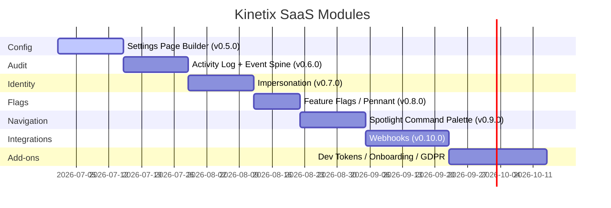

# Kinetix SaaS Features Roadmap

Kinetix accelerates MVP and SaaS development by shipping the **repetitive,
every-product features** as first-class, opt-in modules. This roadmap is the
plan for the next set of those modules.

It supersedes the initial draft with three structural changes agreed during
review:

1. **A shared event spine first.** Audit, Impersonation and Webhooks all revolve
   around "something happened". Instead of each reinventing event capture, a
   small Kinetix event spine lands with the Audit module and is consumed by the
   others. This is why **Audit ships before Impersonation**.
2. **Team-scoping is a cross-cutting requirement, not a per-feature afterthought.**
   Every module below resolves the active team through the same bridge the
   Permissions module uses (`currentTeam` + `PermissionRegistrar`).
3. **Two high-value SaaS primitives were added** — Feature Flags (`laravel/pennant`
   bridge) and Onboarding — and **Developer Tokens were demoted** out of the first
   identity stage (only API-first products need them).

---

## Architecture strategy: optional & configurable

Kinetix stays lightweight by treating third-party packages as **suggested,
optional dependencies**, detected at runtime — the same pattern already proven
by the Permissions (`spatie/laravel-permission`) and Billing (`laravel/cashier`)
modules.

1. **Dynamic detection** — features that can use an optional package detect the
   precise symbol they rely on, never assume it:
   - Scout → the `Laravel\Scout\Searchable` contract on the model
   - Activity log → `Spatie\Activitylog\ActivitylogServiceProvider`
   - Webhooks → `Spatie\WebhookServer\WebhookCall`
   - Feature flags → `Laravel\Pennant\Feature`
   - Dev tokens → `Laravel\Sanctum\Sanctum`

   Every optional package is declared in `composer.json` → `suggest`.
2. **Master switch per feature** in `config/kinetix.php` (e.g. `settings.enabled`),
   **off by default**.
3. **A native fallback that fully works** — when the optional package is absent,
   the feature degrades to a built-in driver (never silently "skips"), so the Vue
   components always have data to render.
4. **SemVer** — each stage is a backward-compatible minor release.

---

## Timeline (by dependency order, not calendar)

---

## Stage 1 — Settings Page Builder (`v0.5.0`) — ✅ shipped

Foundational, zero-dependency, and the cleanest fit: a `SettingsPage` defines a
schema with the existing **Forms** engine, so validation/defaults/serialization
are reused for free. Other modules read their config from here.

- **Store**: `kinetix_settings` table (`team_id` nullable, `key`, `value` JSON).
- **Manager + facade**: `KinetixSettings::get('general.site_name', $default)` /
  `set()` / `forget()` / `all()` — team-scoped, cached, with cache invalidation
  on write, and typed (JSON) values incl. an `encrypted` option for secrets.
- **Page abstraction**: extend `SettingsPage`, define `schema()` (Kinetix Form
  components) + a `group()` key prefix; `fill()`/`save()` run through the Form
  (validate + dehydrate). Pages are registered in a provider.
- **Authorization**: gated by a `settings.manage` ability (registers with the
  Permissions registry when that module is on).
- **Scopes**: global, per-team (via `team_id`), and per-user are all expressible.
- **UI**: a `<KinetixSettingsForm>` that wraps `<KinetixForm>` and posts to the
  settings endpoint; `useKinetixSettings` composable.
- **Generator**: `kinetix:make-settings-page`.

## Stage 2 — Activity Log + Event Spine (`v0.6.0`, spatie driver `v0.6.1`) — ✅ shipped

Audit trail with a small shared event spine the later modules reuse.

- **Event spine**: a thin internal dispatcher for Kinetix domain events
  (model changed, user impersonated, settings changed, export finished, …).
- **Bridge**: auto-detect `spatie/laravel-activitylog`; otherwise a **built-in
  `kinetix_activity` table** (always works). A `LogsKinetixActivity` model trait.
- **Captures** model events **and** non-model events (logins, impersonation,
  settings changes) — all team-scoped, with causer/subject and an old→new diff.
- **UI**: `<KinetixActivityLog>` timeline + an `ActivityLogTable`, plus an
  activity tab on a Resource's View/Show page.
- **Retention**: a pruning command + retention config (logs grow unbounded).

## Stage 3 — Impersonation (`v0.7.0`) — ✅ shipped

Admin "log in as user", **audited** via the Stage 2 spine.

- `ImpersonateAction::make()->authorize('impersonate')` on user rows + a session
  manager (`impersonator_id`) and a leave route.
- **Safety (the part that matters)**: an escalation guard (you cannot impersonate
  a more-privileged user — composes with Permissions), the impersonated user's
  permissions/team context apply, and sensitive actions (password/email/2FA/
  billing/account deletion) are blocked while impersonating.
- Every start/stop emits an audited event.
- **UI**: `<KinetixImpersonationBanner>` with a "Return to your account" button.

## Stage 4 — Feature Flags (`v0.8.0`) — ✅ shipped

Gradual rollout and plan-gating — one of the most repetitive SaaS needs.

- **Bridge `laravel/pennant`** when present; otherwise a built-in flag store.
- Per-user / per-team / percentage rollout; **plan-gating synergy** with Billing
  (`canUseFeature`).
- Backend `KinetixFeatures::active('beta-search')` + a `feature` middleware;
  frontend `useKinetixFeature('beta-search')` + a `<KinetixFeature flag="…">`
  gate component (mirrors `<KinetixCan>`).

## Stage 5 — Spotlight Command Palette (`v0.9.0`) — ✅ shipped

Global `Cmd+K` search over models, navigation and actions.

- **Driver**: `laravel/scout` when the model is `Searchable`; otherwise a
  capped, debounced Eloquent `LIKE` fallback.
- **Authorization-aware**: results are gated by policy/permission and scoped to
  the active team — never surface records the user can't see.
- **Registry**: `KinetixSpotlight::register([...])` (searchable models, nav
  links, actions).
- **UI**: `<KinetixSpotlight>` built on Reka `Dialog` + `Listbox` (no native
  controls, per the design rules).

## Stage 6 — Webhooks (`v0.10.0`) — ✅ shipped (native)

Let customers hook platform events into their own services. Highest complexity —
shipped last, on top of the event spine.

- **Bridge `spatie/laravel-webhook-server`** for signing (HMAC), retries with
  backoff and timeouts instead of hand-rolling delivery reliability.
- **Security**: per-endpoint secret + **SSRF protection** (block internal /
  metadata IP ranges on customer-supplied URLs).
- **Event registry**: `KinetixWebhookEvents` declares the subscribable platform
  events; they're fired through the Stage 2 event spine.
- Tables `kinetix_webhook_endpoints` / `kinetix_webhook_logs`, with
  **redelivery/replay** and **log retention**.
- **UI**: `<KinetixWebhookManager>` — endpoints, delivery logs, test payloads,
  secret rotation, per-event toggles.

## Add-ons (post-v0.10, as demand dictates)

- **Developer Tokens (Sanctum)** — personal access tokens with a declared scope
  registry and a one-time plaintext reveal. API-first products only.
- **Onboarding** — first-run checklist, empty states, product tour. Cheap, high
  impact for MVPs.
- **GDPR self-service** — "export my data" (reuses Export) + account deletion.

---

> Status and per-release detail live in [`CHANGELOG.md`](CHANGELOG.md). Each
> stage ships with its `docs/<feature>.md` page, a `kinetix-<feature>` Boost
> skill, a section in the development skill, and translations — same bar as the
> existing modules.
