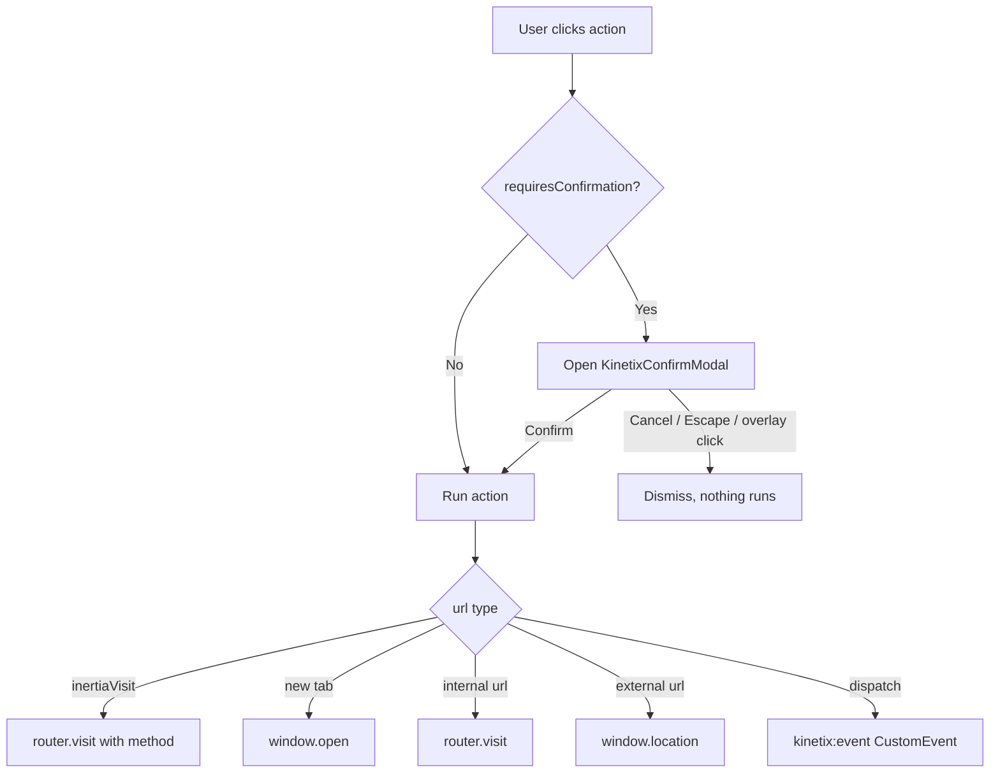

# Kinetix Actions & Confirmation Modals

Kinetix Actions are a fluent PHP builder for interactive buttons and links. The same `Action` class powers notification buttons, **table record actions**, and **table toolbar actions**. This guide focuses on building actions and gating destructive ones behind a **confirmation modal**.

> For notification-specific action behaviour (`markAsRead()`, `close()`), see the [main README](../README.md#actions).

---

## 1. Building an Action

```php
use Happones\Kinetix\Actions\Action;

Action::make('edit')
    ->label('Edit')
    ->icon('edit')
    ->color('primary')
    ->url(fn ($record) => route('users.edit', $record));
```

### Core API

| Method | Description |
|---|---|
| `::make(string $name)` | Create an action |
| `->label(string)` | Button text |
| `->icon(string, string $position = 'before')` | Lucide icon name |
| `->url(string\|Closure, bool $newTab = false)` | Navigate on click; closure receives the record |
| `->inertiaVisit(string $url, array $options = [])` | SPA visit via `router.visit()` (supports `method`) |
| `->dispatch(string $event, array $data = [])` | Fire a `kinetix:{event}` browser event |
| `->button()` / `->link()` | Render style |
| `->color(string)` | `primary` · `success` · `warning` · `danger` · `gray` |
| `->size(string)` | `xs` · `sm` · `md` · `lg` |

---

## 2. Confirmation Modals

Add `requiresConfirmation()` to any action. The action only runs after the user confirms in a modal — ideal for destructive operations like deletes.

```php
Action::make('delete')
    ->label('Delete')
    ->icon('trash')
    ->color('danger')
    ->requiresConfirmation()
    ->modalHeading('Delete user?')
    ->modalDescription('This permanently removes the account and cannot be undone.')
    ->modalSubmitActionLabel('Delete')
    ->modalCancelActionLabel('Keep')
    ->inertiaVisit(fn ($record) => route('users.destroy', $record), ['method' => 'delete']);
```

### Shorthand

Pass the heading straight to `requiresConfirmation()`:

```php
Action::make('archive')
    ->requiresConfirmation('Archive this record?')
    ->color('warning')
    ->inertiaVisit(fn ($r) => route('records.archive', $r), ['method' => 'post']);
```

### Confirmation API

| Method | Description | Default |
|---|---|---|
| `->requiresConfirmation(bool\|string $condition = true)` | Enable the modal; a string also sets the heading | `false` |
| `->modalHeading(string)` | Modal title | `t('kinetix.confirm_heading')` → "Are you sure?" |
| `->modalDescription(string)` | Body text | — |
| `->modalIcon(string)` | Lucide icon shown in the modal | `alert-triangle` |
| `->modalSubmitActionLabel(string)` | Confirm button label | `t('kinetix.confirm')` → "Confirm" |
| `->modalCancelActionLabel(string)` | Cancel button label | `t('kinetix.cancel')` → "Cancel" |

The confirm button inherits the action's `->color()`, so a `danger` action gets a red confirm button automatically.

---

## 3. Behaviour & Lifecycle



When `requiresConfirmation()` is set, clicking the action button opens `KinetixConfirmModal.vue` instead of running immediately. The action runs only on confirm.

---

## 4. Using Actions in Tables

Register actions on a `Table` and they are serialized with each record (record actions) or once for the toolbar:

```php
use Happones\Kinetix\Tables\Table;
use Happones\Kinetix\Actions\Action;

Table::make(User::query())
    ->recordActions([
        Action::make('edit')->icon('edit')->url(fn ($u) => route('users.edit', $u)),
        Action::make('delete')
            ->icon('trash')->color('danger')
            ->requiresConfirmation('Delete this user?')
            ->inertiaVisit(fn ($u) => route('users.destroy', $u), ['method' => 'delete']),
    ])
    ->toolbarActions([
        Action::make('create')->label('New user')->icon('plus')->url(route('users.create')),
    ]);
```

`KinetixTable.vue` handles the full execution flow (dispatch / Inertia visit / new tab / navigation) and the confirmation gate — no extra frontend wiring is needed.

---

## 5. The Confirmation Modal Component

`KinetixConfirmModal.vue` is a self-contained, reusable dialog you can drive directly:

```vue
<script setup lang="ts">
import { ref } from 'vue';
import KinetixConfirmModal from '@/components/kinetix/KinetixConfirmModal.vue';

const open = ref(false);
const onConfirm = () => { /* ... */ };
</script>

<template>
    <button @click="open = true">Delete</button>

    <KinetixConfirmModal
        v-model:open="open"
        color="danger"
        heading="Delete item?"
        description="This cannot be undone."
        @confirm="onConfirm"
    />
</template>
```

| Prop | Type | Description |
|---|---|---|
| `open` | `boolean` | Visibility (use `v-model:open`) |
| `heading` | `string?` | Title (falls back to the i18n default) |
| `description` | `string?` | Body text |
| `icon` | `string?` | Lucide icon name |
| `color` | `string?` | Themes the confirm button + icon (`danger` default) |
| `submitLabel` / `cancelLabel` | `string?` | Button labels (fall back to i18n) |

**Events:** `confirm`, `cancel`, `update:open`.

The modal is rendered through `<Teleport to="body">`, closes on overlay click or `Escape`, and removes its keydown listener when closed or unmounted — so it leaves no lingering global handlers.

---

## 6. Page Action Bars

`KinetixPageHeader.vue` renders a page-level header with a title, optional description, and a right-aligned row of actions — the standard place for "Create", "Edit", "Delete", or custom page actions. It reuses the same action execution and confirmation flow as tables.

### Backend

Build the actions in PHP and pass them as an array:

```php
use Happones\Kinetix\Actions\Action;

return inertia('Users/Edit', [
    'user' => $user,
    'headerActions' => [
        Action::make('view')
            ->label('View')->icon('eye')->color('gray')
            ->url(route('users.show', $user)),

        Action::make('delete')
            ->label('Delete')->icon('trash')->color('danger')
            ->requiresConfirmation('Delete this user?')
            ->inertiaVisit(route('users.destroy', $user), ['method' => 'delete']),
    ],
]);
```

### Frontend

```vue
<script setup lang="ts">
import KinetixPageHeader from '@/components/kinetix/KinetixPageHeader.vue';
import type { KinetixAction } from '@/types';

defineProps<{ headerActions: KinetixAction[] }>();
</script>

<template>
    <KinetixPageHeader
        heading="Edit user"
        description="Update the account details below."
        :actions="headerActions"
    >
        <!-- Optional extra controls via the default slot -->
    </KinetixPageHeader>
</template>
```

| Prop | Type | Description |
|---|---|---|
| `heading` | `string?` | Page title |
| `description` | `string?` | Sub-heading text |
| `actions` | `KinetixAction[]` | Serialized actions rendered as buttons/links |

**Slots:** `before-actions` (left of the action row) and the default slot (right of it). Actions with `requiresConfirmation()` open the shared confirmation modal automatically.

### Shared execution composable

Both `KinetixTable.vue` and `KinetixPageHeader.vue` consume `@/composables/useKinetixActions`:

- `executeAction(action)` — runs an action (dispatch / Inertia visit / new tab / navigation).
- `useActionConfirmation()` — returns `{ pendingAction, isConfirmOpen, requestAction, confirm, cancel }` to gate actions behind the modal.

Wire any new action-rendering component through this composable so behaviour stays consistent.

---

## 7. Action Groups (Dropdowns)

`ActionGroup` collapses several actions into a single dropdown trigger — useful for keeping record rows and toolbars compact.

```php
use Happones\Kinetix\Actions\Action;
use Happones\Kinetix\Actions\ActionGroup;

ActionGroup::make([
    Action::make('edit')->label('Edit')->icon('edit')->url(fn ($r) => route('users.edit', $r)),
    Action::make('view')->label('View')->icon('eye')->url(fn ($r) => route('users.show', $r)),
    Action::make('delete')->label('Delete')->icon('trash')->color('danger')
        ->requiresConfirmation('Delete this user?')
        ->inertiaVisit(fn ($r) => route('users.destroy', $r), ['method' => 'delete']),
])
    ->label('Actions')      // optional — omit for an icon-only trigger
    ->icon('ellipsis-vertical');
```

| Method | Description | Default |
|---|---|---|
| `::make(array $actions)` | Actions shown in the menu | — |
| `->actions(array)` | Replace the action list | — |
| `->label(string)` | Trigger label (omit for icon-only) | — |
| `->icon(string)` | Trigger icon | `ellipsis-vertical` |
| `->color(string)` / `->size(string)` | Trigger styling | `gray` / `sm` |

Groups serialize to an `ActionData` with `type: 'group'` and a nested `actions` array, so they can be dropped straight into a table's `recordActions()` / `toolbarActions()` or a page header's `actions` alongside regular actions:

```php
Table::make(User::query())->recordActions([
    Action::make('edit')->icon('edit')->url(fn ($u) => route('users.edit', $u)),
    ActionGroup::make([
        Action::make('archive')->icon('archive')->requiresConfirmation('Archive?')
            ->inertiaVisit(fn ($u) => route('users.archive', $u), ['method' => 'post']),
        Action::make('delete')->icon('trash')->color('danger')->requiresConfirmation('Delete?')
            ->inertiaVisit(fn ($u) => route('users.destroy', $u), ['method' => 'delete']),
    ]),
]);
```

`KinetixActionDropdown.vue` renders the menu. It closes on outside click or `Escape` and removes those listeners on close/unmount (leak-safe), and routes each item through the shared confirmation flow.

---

## 8. Prebuilt CRUD actions

Convenience subclasses with sensible defaults (label, icon, color) and a default policy ability. Each is a normal `Action`, so every method above still applies.

```php
use Happones\Kinetix\Actions\CreateAction;
use Happones\Kinetix\Actions\EditAction;
use Happones\Kinetix\Actions\ViewAction;
use Happones\Kinetix\Actions\DeleteAction;

Table::make(Post::query())
    ->recordActions([
        ViewAction::make()->url(fn ($post) => route('posts.show', $post)),
        EditAction::make()->url(fn ($post) => route('posts.edit', $post)),
        DeleteAction::make()->inertiaVisit(fn ($post) => route('posts.destroy', $post), ['method' => 'delete']),
    ])
    ->toolbarActions([
        CreateAction::make()->url(route('posts.create'))->authorize('create', Post::class),
    ]);
```

| Action | Defaults | Default policy ability |
|---|---|---|
| `ViewAction` | label `View`, icon `eye` | `view` (per record) |
| `EditAction` | label `Edit`, icon `edit` | `update` (per record) |
| `DeleteAction` | label `Delete`, icon `trash`, color `danger`, `requiresConfirmation()` | `delete` (per record) |
| `CreateAction` | label `Create`, icon `plus`, color `primary` | none — pass `->authorize('create', Model::class)` |
| `RestoreAction` | label `Restore`, icon `rotate-ccw`; only visible on trashed rows | `restore` (per record) |
| `ForceDeleteAction` | label `Delete permanently`, icon `trash-2`, danger, `requiresConfirmation()`; only on trashed rows | `forceDelete` (per record) |

`RestoreAction` / `ForceDeleteAction` are for `SoftDeletes` models and auto-hide on non-trashed records (via a `visible()` check on `$record->trashed()`). Pair them with a `TrashedFilter` ([Tables → Filters](tables.md)).

Labels come from the `kinetix` i18n namespace and respect the active locale.

---

## 9. Authorization & visibility

Actions are authorized **on the server**. An action that fails its check is **omitted from the serialized payload entirely** — the frontend never receives it (so it can't be revealed by tampering with the client). This is the recommended approach over sending every action plus a "can" flag to Vue.

```php
// Laravel policy ability — checked against the row record via Gate::allows($ability, $record):
EditAction::make()->authorize('update');

// Explicit subject (e.g. a create action with no record):
CreateAction::make()->authorize('create', Post::class);

// Any custom logic:
Action::make('publish')->authorize(fn ($record) => auth()->user()->isEditor());

// Manual visibility (also evaluated server-side):
Action::make('archive')->visible(fn ($record) => ! $record->archived);
Action::make('legacy')->hidden();
```

| Method | Behaviour |
|---|---|
| `->authorize(string $ability, mixed $subject = null)` | `Gate::allows($ability, $subject ?? $record)` (Laravel policies) |
| `->authorize(Closure $cb)` | `$cb($record)` returns a boolean |
| `->authorize(bool)` | Static gate |
| `->visible(bool\|Closure)` / `->hidden(bool\|Closure)` | Manual show/hide |

`Table` automatically drops unauthorized record/toolbar actions (and per row). `ActionGroup` drops unauthorized children, and supports `->authorize()`/`->visible()` on the group itself. For page headers or other manual contexts, serialize a set with `Action::toArrayMany([...], $record)` — it returns only the actions the current user may perform:

```php
return inertia('Posts/Edit', [
    'headerActions' => \Happones\Kinetix\Actions\Action::toArrayMany([
        EditAction::make()->url(route('posts.edit', $post)),
        DeleteAction::make()->inertiaVisit(route('posts.destroy', $post), ['method' => 'delete']),
    ], $post),
]);
```

---

## 10. Localization

Default modal labels come from the `kinetix` translation namespace (`confirm`, `cancel`, `confirm_heading`), shipped in English, Spanish, French, and Portuguese.
