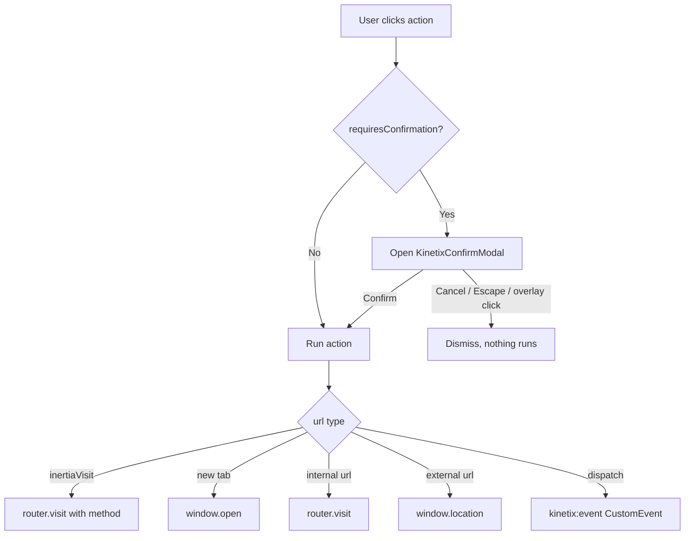

# Kinetix Actions & Confirmation Modals

Kinetix Actions are a fluent PHP builder for interactive buttons and links. The same `Action` class powers notification buttons, **table record actions**, and **table toolbar actions**. This guide focuses on building actions and gating destructive ones behind a **confirmation modal**.

> For notification-specific action behaviour (`markAsRead()`, `markAsUnread()`, `close()`), see the [main README](https://github.com/happones/kinetix#actions).

---

## 1. Building an Action

```php
use Happones\Kinetix\Actions\Action;

Action::make('edit')
    ->label('Edit')
    ->icon('edit')
    ->color('primary')
    ->url(fn ($record) => route('users.edit', $record));
```

### Core API

| Method | Description |
|---|---|
| `::make(string $name)` | Create an action |
| `->label(string)` | Button text |
| `->icon(string, string $position = 'before')` | Lucide icon name — see [Icons](icons.md) for the shipped set and how to register your own |
| `->url(string\|Closure, bool $newTab = false)` | Navigate on click; closure receives the record |
| `->route(string $name, array $params = [], string $method = 'get')` | Point at a **named route** — the intuitive CRUD wiring (see below) |
| `->inertiaVisit(string $url, array $options = [])` | SPA visit via `router.visit()` (supports `method`) |
| `->dispatch(string $event, array $data = [])` | Fire a `kinetix:{event}` browser event |
| `->button()` / `->link()` | Render style |
| `->iconButton(bool = true)` | Compact **icon-only** button — no visible label, no outline (the shadcn row-action style). The label is kept for `aria-label`/tooltip, so always set `->icon()` too. If the icon name cannot be resolved the button falls back to showing its **label** rather than rendering empty — see [Icons](icons.md). |
| `->color(string)` | `primary` · `secondary` · `success` · `warning` · `info` · `danger` · `gray` |
| `->icon(?string, $position = 'before')` | Lucide icon name; pass `null` to remove it |
| `->size(string)` | `xs` · `sm` · `md` · `lg` |

Colors map to shadcn tokens (themeable, dark-mode aware), so you can reproduce the "classic" admin palette per action when you want it. These are the colors you can **opt into** with `->color()` — they are not the prebuilt defaults (`ViewAction`/`EditAction` are neutral `gray` unless you pass `->color()`; see §8):

| Color | Token | Looks like | Classic use |
|---|---|---|---|
| `primary` | `primary` | brand/solid | Create (the prebuilt default) |
| `info` | `info` | **blue** | View/Show |
| `warning` | `warning` | **amber/yellow** | Edit |
| `success` | `success` | **green** | Create |
| `danger` | `destructive` | **red** | Delete (the prebuilt default) |
| `gray` / `secondary` | `outline` / `secondary` | neutral | View/Edit (the prebuilt default) |

```php
ViewAction::make()->color('info'),      // opt-in blue (gray by default)
EditAction::make()->color('warning'),   // opt-in amber (gray by default)
CreateAction::make()->color('success'), // opt-in green (primary by default)
// DeleteAction is danger (red) by default
```

> **shadcn guidance:** by default Kinetix keeps secondary actions neutral (`outline`/`ghost`) and only `delete` red — distinguishing actions by **icon**, which is the idiomatic shadcn approach. Reach for the colored palette above only if you specifically want the classic colored-button look; it stays token-based either way.

### `->route()` — named-route wiring (recommended for CRUD)

Instead of hand-writing a `->url(fn ($r) => route(...))` closure, point an action at a
**named route**. Kinetix resolves it by convention and — crucially — **auto-hides the
action when the route isn't registered** (`Route::has`), so you never ship a button that
leads nowhere:

```php
use Happones\Kinetix\Actions\{ViewAction, EditAction, DeleteAction, CreateAction};

$table
    ->recordActions([
        ViewAction::make()->route('posts.show'),                       // → /posts/{post}
        EditAction::make()->route('posts.edit'),                       // → /posts/{post}/edit
        DeleteAction::make()->route('posts.destroy', method: 'delete'),// Inertia DELETE
    ])
    ->toolbarActions([
        CreateAction::make()->route('posts.create'),                   // → /posts/create
    ]);
```

- **Per-record vs static** is detected automatically: a route with a record parameter
  (e.g. `posts.edit` → `/posts/{post}`) is resolved per row from the record; a route
  without one (e.g. `posts.create`) resolves once for a toolbar button.
- The `{current_team}` segment is auto-filled, exactly like `->url()`.
- `$method` `'get'` navigates; any other verb performs an `->inertiaVisit()` with that
  method (for destroy/restore endpoints).
- If the route isn't registered, the action is dropped from the payload — no dead button.

This is what `kinetix:make-resource` writes into the generated **resource's `table()`**,
so all actions live in one place and only appear once you register the routes
(`Route::resource(...)`).

---

## 2. Confirmation Modals

Add `requiresConfirmation()` to any action. The action only runs after the user confirms in a modal — ideal for destructive operations like deletes.

```php
Action::make('delete')
    ->label('Delete')
    ->icon('trash')
    ->color('danger')
    ->requiresConfirmation()
    ->modalHeading('Delete user?')
    ->modalDescription('This permanently removes the account and cannot be undone.')
    ->modalSubmitActionLabel('Delete')
    ->modalCancelActionLabel('Keep')
    ->inertiaVisit(fn ($record) => route('users.destroy', $record), ['method' => 'delete']);
```

### Shorthand

Pass the heading straight to `requiresConfirmation()`:

```php
Action::make('archive')
    ->requiresConfirmation('Archive this record?')
    ->color('warning')
    ->inertiaVisit(fn ($r) => route('records.archive', $r), ['method' => 'post']);
```

### Confirmation API

| Method | Description | Default |
|---|---|---|
| `->requiresConfirmation(bool\|string $condition = true)` | Enable the modal; a string also sets the heading | `false` |
| `->modalHeading(string)` | Modal title | `t('kinetix.confirm_heading')` → "Are you sure?" |
| `->modalDescription(string)` | Body text | — |
| `->modalIcon(string)` | Lucide icon shown in the modal | `alert-triangle` |
| `->modalSubmitActionLabel(string)` | Confirm button label | `t('kinetix.confirm')` → "Confirm" |
| `->modalCancelActionLabel(string)` | Cancel button label | `t('kinetix.cancel')` → "Cancel" |

The confirm button inherits the action's `->color()`, so a `danger` action gets a red confirm button automatically.

---

## 3. Behaviour & Lifecycle



When `requiresConfirmation()` is set, clicking the action button opens `KinetixConfirmModal.vue` instead of running immediately. The action runs only on confirm.

### `->inertiaVisit()` vs `->request()`

| Method | Use when | Behaviour |
|---|---|---|
| `->inertiaVisit($url, ['method' => 'post'])` | The route returns an **Inertia response** (`redirect()`/`back()`/`Inertia::render`) | `router.visit()` — full Inertia visit (updates page props). |
| `->request($url, ['method' => 'post', 'toast' => '…'])` | The route returns **JSON** and you just want a background call + a toast (no navigation) | Plain `fetch()` XHR (with the XSRF token); shows the `toast` on success. **No Inertia involvement.** |

> **Avoiding Inertia's "invalid response" modal:** an `->inertiaVisit()` to an endpoint that returns JSON (instead of an Inertia redirect/render) makes Inertia pop its error modal. For fire-and-forget endpoints (queue a job, then notify), use `->request()` so no Inertia visit happens. This is exactly what `ExportAction` uses — click → background POST → "Export queued" toast → a download notification arrives when the job finishes.

---

## 4. Using Actions in Tables

Register actions on a `Table` and they are serialized with each record (record actions) or once for the toolbar:

```php
use Happones\Kinetix\Tables\Table;
use Happones\Kinetix\Actions\Action;

Table::make(User::query())
    ->recordActions([
        Action::make('edit')->icon('edit')->url(fn ($u) => route('users.edit', $u)),
        Action::make('delete')
            ->icon('trash')->color('danger')
            ->requiresConfirmation('Delete this user?')
            ->inertiaVisit(fn ($u) => route('users.destroy', $u), ['method' => 'delete']),
    ])
    ->toolbarActions([
        Action::make('create')->label('New user')->icon('plus')->url(route('users.create')),
    ]);
```

`KinetixTable.vue` handles the full execution flow (dispatch / Inertia visit / new tab / navigation) and the confirmation gate — no extra frontend wiring is needed.

---

## 5. The Confirmation Modal Component

`KinetixConfirmModal.vue` is a self-contained, reusable dialog you can drive directly:

```vue
<script setup lang="ts">
import { ref } from 'vue';
import KinetixConfirmModal from '@/components/kinetix/KinetixConfirmModal.vue';

const open = ref(false);
const onConfirm = () => { /* ... */ };
</script>

<template>
    <button @click="open = true">Delete</button>

    <KinetixConfirmModal
        v-model:open="open"
        color="danger"
        heading="Delete item?"
        description="This cannot be undone."
        @confirm="onConfirm"
    />
</template>
```

| Prop | Type | Description |
|---|---|---|
| `open` | `boolean` | Visibility (use `v-model:open`) |
| `heading` | `string?` | Title (falls back to the i18n default) |
| `description` | `string?` | Body text |
| `icon` | `string?` | Lucide icon name |
| `color` | `string?` | Themes the confirm button + icon (`danger` default) |
| `submitLabel` / `cancelLabel` | `string?` | Button labels (fall back to i18n) |

**Events:** `confirm`, `cancel`, `update:open`.

The modal is rendered through `<Teleport to="body">`, closes on overlay click or `Escape`, and removes its keydown listener when closed or unmounted — so it leaves no lingering global handlers.

---

## 6. Page Action Bars

A page gets two action bars, and **neither knows anything about what the page renders between them** — that independence is the point. Put a table, a form, or a component entirely of your own in the middle:

```vue
<KinetixPageHeader heading="Inventory" :actions="headerActions" />

<MyCustomThing />          <!-- anything at all -->

<KinetixPageFooter :actions="footerActions" />
```

`KinetixPageHeader.vue` renders a page-level header with a title, optional description, and a right-aligned row of actions — the standard place for "Create", "Edit", "Delete", or custom page actions. `KinetixPageFooter.vue` is its counterpart for the end of the page ("Save", "Cancel", "Archive"). Both reuse the same action execution and confirmation flow as tables.

<Screenshot name="page-header" alt="Page header with actions" />

Grouped actions render as a dropdown menu (`KinetixActionDropdown`). Its trigger
follows shadcn: with **no group label** it's a borderless ghost **⋮** icon button
(the row-action style); set a label to get an outlined, labelled trigger instead.

<Screenshot name="action-dropdown" alt="Action dropdown — ghost ellipsis trigger" />

### Backend

Build the actions in PHP and pass them as an array:

```php
use Happones\Kinetix\Actions\Action;

return inertia('Users/Edit', [
    'user' => $user,
    'headerActions' => [
        Action::make('view')
            ->label('View')->icon('eye')->color('gray')
            ->url(route('users.show', $user)),

        Action::make('delete')
            ->label('Delete')->icon('trash')->color('danger')
            ->requiresConfirmation('Delete this user?')
            ->inertiaVisit(route('users.destroy', $user), ['method' => 'delete']),
    ],
]);
```

### Frontend

```vue
<script setup lang="ts">
import KinetixPageHeader from '@/components/kinetix/KinetixPageHeader.vue';
import type { KinetixAction } from '@/types/kinetix';

defineProps<{ headerActions: KinetixAction[] }>();
</script>

<template>
    <KinetixPageHeader
        heading="Edit user"
        description="Update the account details below."
        :actions="headerActions"
    >
        <!-- Optional extra controls via the default slot -->
    </KinetixPageHeader>
</template>
```

| Prop | Type | Description |
|---|---|---|
| `heading` | `string?` | Page title |
| `description` | `string?` | Sub-heading text |
| `actions` | `KinetixAction[]` | Serialized actions rendered as buttons/links |

**Slots:** `before-actions` (left of the action row) and the default slot (right of it). Actions with `requiresConfirmation()` open the shared confirmation modal automatically.

### Footer actions: `KinetixPageFooter`

<Screenshot name="page-footer" alt="A page footer bar: a save-state note on the left, Cancel and Save changes right-aligned" />

Same contract, bottom of the page:

```php
return inertia('Inventory/Adjust', [
    'item' => $item,
    'footerActions' => [
        Action::make('cancel')
            ->label(__('inventory.cancel'))->color('gray')
            ->url(route('inventory.index')),

        Action::make('post')
            ->label(__('inventory.post'))->icon('check')
            ->requiresConfirmation(__('inventory.post_confirm'))
            ->inertiaVisit(route('inventory.post', $item), ['method' => 'post']),
    ],
]);
```

```vue
<KinetixPageFooter :actions="footerActions" sticky>
    <template #before-actions>Last saved 2 minutes ago</template>
</KinetixPageFooter>
```

| Prop | Type | Description |
|---|---|---|
| `actions` | `KinetixAction[]` | Serialized actions |
| `sticky` | `boolean?` | Pin the bar to the bottom of the scroll container (default `false`) |
| `shortcuts` | `boolean?` | Bind the actions' `->shortcut()` keys (default **`false`** — see below) |

**Slots:** `before-actions` (left of the row — a save state, a hint, a validation summary) and the default slot (right of it).

The action row is `flex-col-reverse` below `sm`, which puts the **last** action — the primary one, by convention — on top where the thumb is, and full width. From `sm` up it is a right-aligned row. Same rule as the dialog shells' footers, so a footer looks the same on a page and in a modal.

::: tip `sticky` is `position: sticky`, not `fixed`
The pinned bar stays part of the layout, so it never covers the last of your content the way a fixed bar does — no bottom padding to remember. Use it for a long page where "Save" should stay reachable without scrolling to the end.
:::

<Screenshot name="page-footer-sticky" alt="The same footer bar pinned, with a top border and solid background" />

::: warning `shortcuts` defaults to off in the footer
A footer usually repeats actions the header already bound, and two handlers on one chord is a bug. Turn it on only for actions that live **only** in the footer.
:::

### One implementation behind both: `KinetixActionBar`

Both bars render their actions through `KinetixActionBar.vue`, so a grouped dropdown, a `requiresConfirmation()` modal, a declared shortcut and a pending spinner behave identically top and bottom. Use it directly when you need an action row somewhere neither bar fits:

```vue
<KinetixActionBar :actions="actions" :shortcuts="false" stack />
```

| Prop | Type | Description |
|---|---|---|
| `actions` | `KinetixAction[]` | Serialized actions |
| `shortcuts` | `boolean?` | Bind declared shortcut keys (default `true`) |
| `stack` | `boolean?` | Full-width stacked below `sm`, right-aligned row above (default `false` — the header's inline, wrapping row) |

**Slots:** `before` and `after`.

### Header actions that open a form in a modal

A header action carries no form of its own — when a "New …" button should open
a modal form on the same page, give the action `->dispatch()` and let the page
host the modal. Pass **`flat`** to the form so its Sections don't render as a
card inside the modal panel:

```php
Action::make('new-event')->label('New event')->icon('plus')->dispatch('event-create');
```

```vue
<script setup lang="ts">
onMounted(() => window.addEventListener('kinetix:event-create', open));
onUnmounted(() => window.removeEventListener('kinetix:event-create', open));
</script>

<template>
    <KinetixPageHeader heading="Schedule" :actions="headerActions" />
    <KinetixModal :open="isOpen" title="New event" scroll-body @update:open="isOpen = $event">
        <KinetixForm :form="eventForm" flat @submit="submit" />
    </KinetixModal>
</template>
```

The controller persists and flashes a toast (`back()->with('kinetix_toast',
__('kinetix.record_created'))`). Full worked examples live in the
[Kanban](/kanban#adding-editing-cards) and
[Calendar](/calendar#_7-creating-editing-events) guides.

> `->modal('create'|'edit'|'view'|'delete')` is a different mechanism: it opens
> the **table-hosted record modals** and therefore only works on actions
> rendered inside a table that opted in via `Table::recordModals()` — see
> [Simple resources](/resources#_2-simple-resource-simple). In a page header it
> is a no-op.

### Shared execution composable

`KinetixTable.vue` and `KinetixActionBar.vue` (and therefore both page bars) consume `@/composables/useKinetixActions`:

- `executeAction(action)` — runs an action (dispatch / Inertia visit / new tab / navigation).
- `useActionConfirmation()` — returns `{ pendingAction, isConfirmOpen, processing, processingAction, requestAction, confirm, cancel }` to gate actions behind the modal.

Wire any new action-rendering component through this composable so behaviour stays consistent.

### Pending state & double-click protection (automatic)

Every action click is gated twice:

1. **Logic:** `useActionConfirmation()` ignores clicks while an action is in
   flight (`processing`), and awaits `httpRequest`/`inertiaVisit` actions — so
   a double click on Export/Import can never queue two jobs, and confirmation
   modals stay open (disabled) until the request resolves.
2. **UI:** action buttons render through **`<KinetixButton>`** — the shared
   base button. While `processing` is true every sibling action button
   disables, and the **clicked** one (matched via `processingAction`, the
   in-flight action's name) swaps its icon for a spinner.

`KinetixButton` props: `variant`, `size`, `type` (default `button`), `loading`
(disables + spinner, sets `aria-busy`), `disabled`. Slots: `icon` (replaced by
the spinner while loading) and the default label slot. The
`kinetix:make-resource` create/edit pages submit through it too
(`:loading="saving"`), so scaffolded forms behave exactly like action buttons.
Use it for any custom button that fires a request:

```vue
<KinetixButton :loading="saving" type="submit">Save</KinetixButton>
```

---

## 7. Action Groups (Dropdowns)

`ActionGroup` collapses several actions into a single dropdown trigger — useful for keeping record rows and toolbars compact.

> **Where ActionGroups work:** `recordActions`, `toolbarActions`/`headerActions`, and `footerActions` render groups as dropdowns. **`bulkActions` do not** — the bulk bar renders flat buttons and a dropdown wouldn't forward the selected `ids`. So you **can** put an Export (or any) action inside a group in the toolbar/header/footer (it acts on the whole/filtered table), but for **export-selected** use a flat `bulkActions` entry (see [Tables → Bulk Actions](tables.md#bulk-actions)). The same Export `Action` can be both: inside a toolbar group **and** a flat bulk action.

```php
use Happones\Kinetix\Actions\Action;
use Happones\Kinetix\Actions\ActionGroup;

ActionGroup::make([
    Action::make('edit')->label('Edit')->icon('edit')->url(fn ($r) => route('users.edit', $r)),
    Action::make('view')->label('View')->icon('eye')->url(fn ($r) => route('users.show', $r)),
    Action::make('delete')->label('Delete')->icon('trash')->color('danger')
        ->requiresConfirmation('Delete this user?')
        ->inertiaVisit(fn ($r) => route('users.destroy', $r), ['method' => 'delete']),
])
    ->label('Actions')      // optional — omit for an icon-only trigger
    ->icon('ellipsis-vertical');
```

| Method | Description | Default |
|---|---|---|
| `::make(array $actions)` | Actions shown in the menu | — |
| `->actions(array)` | Replace the action list | — |
| `->label(string)` | Trigger label (omit for icon-only) | — |
| `->icon(string)` | Trigger icon | `ellipsis-vertical` |
| `->color(string)` / `->size(string)` | Trigger styling | `gray` / `sm` |

Groups serialize to an `ActionData` with `type: 'group'` and a nested `actions` array, so they can be dropped straight into a table's `recordActions()` / `toolbarActions()` or a page header's `actions` alongside regular actions:

```php
Table::make(User::query())->recordActions([
    Action::make('edit')->icon('edit')->url(fn ($u) => route('users.edit', $u)),
    ActionGroup::make([
        Action::make('archive')->icon('archive')->requiresConfirmation('Archive?')
            ->inertiaVisit(fn ($u) => route('users.archive', $u), ['method' => 'post']),
        Action::make('delete')->icon('trash')->color('danger')->requiresConfirmation('Delete?')
            ->inertiaVisit(fn ($u) => route('users.destroy', $u), ['method' => 'delete']),
    ]),
]);
```

`KinetixActionDropdown.vue` renders the menu. It closes on outside click or `Escape` and removes those listeners on close/unmount (leak-safe), and routes each item through the shared confirmation flow.

---

## 8. Prebuilt CRUD actions

Convenience subclasses with sensible defaults (label, icon, color) and a default policy ability. Each is a normal `Action`, so every method above still applies.

```php
use Happones\Kinetix\Actions\CreateAction;
use Happones\Kinetix\Actions\EditAction;
use Happones\Kinetix\Actions\ViewAction;
use Happones\Kinetix\Actions\DeleteAction;

Table::make(Post::query())
    ->recordActions([
        ViewAction::make()->url(fn ($post) => route('posts.show', $post)),
        EditAction::make()->url(fn ($post) => route('posts.edit', $post)),
        DeleteAction::make()->inertiaVisit(fn ($post) => route('posts.destroy', $post), ['method' => 'delete']),
    ])
    ->toolbarActions([
        CreateAction::make()->url(route('posts.create'))->authorize('create', Post::class),
    ]);
```

| Action | Defaults | Default policy ability |
|---|---|---|
| `ViewAction` | label `View`, icon `eye`, color `gray` | `view` (per record) |
| `EditAction` | label `Edit`, icon `edit`, color `gray` | `update` (per record) |
| `DeleteAction` | label `Delete`, icon `trash`, color `danger`, `requiresConfirmation()` | `delete` (per record) |
| `CreateAction` | label `Create`, icon `plus`, color `primary` | none — pass `->authorize('create', Model::class)` |
| `RestoreAction` | label `Restore`, icon `rotate-ccw`, color `gray`; only visible on trashed rows | `restore` (per record) |
| `ForceDeleteAction` | label `Delete permanently`, icon `trash-2`, color `danger`, `requiresConfirmation()`; only on trashed rows | `forceDelete` (per record) |
| `ExportAction` | label `Export`, icon `download`, color `gray` | none — wire with `->exporter(MyExporter::class)` |
| `ImportAction` | label `Import`, icon `upload`, color `gray` | none — wire with `->importer(MyImporter::class)` |

Only `CreateAction` (`primary`), `DeleteAction` and `ForceDeleteAction` (`danger`) ship colored by default — every other prebuilt action is neutral `gray`, distinguished by its icon. Add `->color(...)` to opt into the classic colored palette (see §1).

`RestoreAction` / `ForceDeleteAction` are for `SoftDeletes` models and auto-hide on non-trashed records (via a `visible()` check on `$record->trashed()`). Pair them with a `TrashedFilter` ([Tables → Filters](tables.md)).

Labels come from the `kinetix` i18n namespace and respect the active locale.

### Data actions: `ExportAction` & `ImportAction`

```php
use Happones\Kinetix\Actions\ExportAction;
use Happones\Kinetix\Actions\ImportAction;

$table->toolbarActions([
    ExportAction::make()->exporter(UsersExporter::class),
    ImportAction::make()->importer(UsersImporter::class),
]);
```

| Action | Defaults | Behaviour |
|---|---|---|
| `ExportAction` | label `Export`, icon `download`, color `gray` | `->exporter(MyExporter::class)` wires a background `->request()` POST to `route('kinetix.exports.start')` (the exporter travels as a signed token). The JSON response shows the `kinetix.export_started` toast — no Inertia visit — and the user gets a download notification when the queued job finishes. In `toolbarActions`/`headerActions` it exports the exporter's query; in `bulkActions` it exports only the selected rows. |
| `ImportAction` | label `Import`, icon `upload`, color `gray` | `->importer(MyImporter::class)` dispatches the `kinetix:open-importer` browser event (carrying the importer's signed token), opening the import preview modal. Mount `<KinetixImportModal>` once in your layout for it to render. |

### File actions: `DownloadAction` & `PreviewAction`

```php
use Happones\Kinetix\Actions\DownloadAction;
use Happones\Kinetix\Actions\PreviewAction;

$table->recordActions([
    PreviewAction::make()->url(fn ($doc) => route('docs.show', $doc)),         // image/pdf detected from the URL
    PreviewAction::make()->preview('pdf')->url(fn ($doc) => $doc->pdf_url),     // force a type
    DownloadAction::make()->url(fn ($doc) => route('docs.download', $doc)),     // direct download
]);
```

| Action | Defaults | Behaviour |
|---|---|---|
| `PreviewAction` | label `Preview`, icon `eye`, color `gray` | Opens `url` in the file-preview lightbox (zoomable image / embedded PDF, with a download button). `->preview('image'\|'pdf'\|'auto')` sets the type. |
| `DownloadAction` | label `Download`, icon `download`, color `gray` | Forces a browser download of `url` (synthetic `<a download>` click). |

Both are plain `Action`s, so `->color()`, `->icon()`, `->label()`, `->authorize()`, `->visible()` all apply. The underlying flags are `Action::download()` and `Action::preview($type)`.

> **Mount the lightbox once.** For `PreviewAction` (and `ImageColumn::preview()`) to render, add `<KinetixFilePreview />` once in your app layout — it listens for the `kinetix:preview` window event, like the notification components.

---

## 9. Authorization & visibility

Actions are authorized **on the server**. An action that fails its check is **omitted from the serialized payload entirely** — the frontend never receives it (so it can't be revealed by tampering with the client). This is the recommended approach over sending every action plus a "can" flag to Vue.

```php
// Laravel policy ability — checked against the row record via Gate::allows($ability, $record):
EditAction::make()->authorize('update');

// Explicit subject (e.g. a create action with no record):
CreateAction::make()->authorize('create', Post::class);

// Any custom logic:
Action::make('publish')->authorize(fn ($record) => auth()->user()->isEditor());

// Manual visibility (also evaluated server-side):
Action::make('archive')->visible(fn ($record) => ! $record->archived);
Action::make('legacy')->hidden();
```

| Method | Behaviour |
|---|---|
| `->authorize(string $ability, mixed $subject = null)` | `Gate::allows($ability, $subject ?? $record)` (Laravel policies) |
| `->authorize(Closure $cb)` | `$cb($record)` returns a boolean |
| `->authorize(bool)` | Static gate |
| `->visible(bool\|Closure)` / `->hidden(bool\|Closure)` | Manual show/hide |

`Table` automatically drops unauthorized record/toolbar actions (and per row). `ActionGroup` drops unauthorized children, and supports `->authorize()`/`->visible()` on the group itself. For page headers or other manual contexts, serialize a set with `Action::toArrayMany([...], $record)` — it returns only the actions the current user may perform:

```php
return inertia('Posts/Edit', [
    'headerActions' => \Happones\Kinetix\Actions\Action::toArrayMany([
        EditAction::make()->url(route('posts.edit', $post)),
        DeleteAction::make()->inertiaVisit(route('posts.destroy', $post), ['method' => 'delete']),
    ], $post),
]);
```

> **Team-aware URL resolution.** When `Action::toData()` resolves a closure URL, it first detects the current team — from the `current_team`/`team` route parameter, or (when `kinetix.teams` is enabled) the authenticated user's `currentTeam` — and populates `URL::defaults()` with `current_team`/`team` params (plus `:slug` and `:id` variants) before invoking the closure. So `fn ($record) => route('team.posts.edit', $record)` resolves with the active team's parameters filled in automatically, without threading the team through every closure.

---

## 10. Localization

Default modal labels come from the `kinetix` translation namespace (`confirm`, `cancel`, `confirm_heading`), shipped in English, Spanish, French, and Portuguese.
