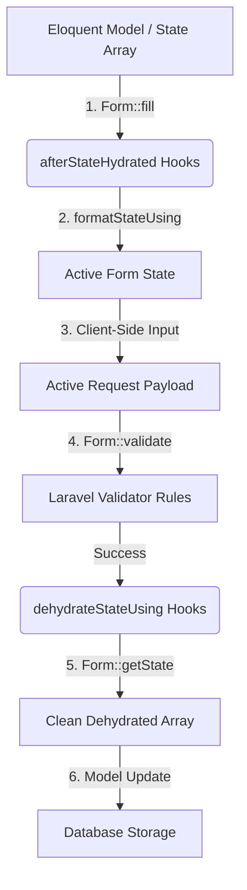

# Kinetix Forms Complete Reference

Kinetix Forms is a schema-driven, DTO-powered form building system built specifically for Vue 3, Inertia.js 3, and Tailwind CSS. By defining form structures, layouts, validation, and lifecycles in PHP, you serialize configurations into structured JSON DTOs that are natively consumed by premium Vue 3 elements.

---

## 1. Core Architecture & Concept

Kinetix Forms decouples form configuration from layout rendering. Instead of writing verbose HTML templates with complex binding logic, you define the entire layout, validation rules, default states, and visibility settings in PHP. 

```mermaid
graph LR
    subgraph Backend (Laravel)
        A[Eloquent Model / Data Sources] --> B[Form Builder Definition]
        B --> C[Spatie FormData DTO]
    end
    subgraph Frontend (Inertia & Vue)
        C -->|JSON Serialization| D[KinetixForm.vue]
        D -->|v-for Schema| E[KinetixFormSchema.vue]
        E -->|Reactive State| F[Interactive User Interface]
    end
```

### Key Principles
1. **Declarative Layouts**: Responsive columns, cards, and layouts are defined through a fluent API.
2. **TypeScript Generation**: Serialized data structure maps to typescript types generated via Spatie's Laravel TypeScript Transformer.
3. **Tailwind JIT Compliance**: Layout columns are computed using CSS custom properties or inline styles rather than dynamic Tailwind classes, avoiding purge and compilation errors.
4. **Unified Validation**: Frontend validation errors map to standard Laravel Validator keybags, maintaining unified error rendering.

---

## 2. Forms Lifecycle & State Management

Form fields follow a strict lifecycle of data transformation during hydration (filling the form) and dehydration (extracting submitted state).



### 1. Hydration
Hydration extracts properties from a model or an array and binds them to the corresponding form fields. This occurs when you call `$form->fill($data)`.

#### Hydration Callbacks
- **`afterStateHydrated(Closure $callback)`**: Executed immediately after a field is populated. The closure receives the raw state value, the field component instance, and the source record (if a Model was passed):
  ```php
  TextInput::make('username')
      ->afterStateHydrated(function (mixed $state, Field $component, ?Model $record) {
          $component->default(strtolower((string) $state));
      });
  ```
- **`formatStateUsing(Closure $callback)`**: A simplified wrapper to transform the value for rendering in the field interface:
  ```php
  TextInput::make('first_name')
      ->formatStateUsing(fn (?string $state): string => ucwords($state ?? ''));
  ```

### 2. Dehydration
Dehydration processes user inputs, validates them, and transforms the states into database-compatible formats when you call `$form->getState($requestData)`.

#### Dehydration Callbacks
- **`dehydrateStateUsing(Closure $callback)`**: Transforms the submitted value before it is returned in the final state array:
  ```php
  TextInput::make('slug')
      ->dehydrateStateUsing(fn (string $state): string => str($state)->slug()->toString());
  ```
- **`saved(bool $condition)`**: Instructs the form whether to include the field's value in the output of `$form->getState()`. For example, presentational helper inputs (like passwords confirmations) should be validated but omitted:
  ```php
  TextInput::make('password_confirmation')
      ->password()
      ->saved(false); // Validated on request, but excluded from database update payloads
  ```

---

## 3. Form Layouts & Containers

Layout elements organize fields inside grids and visual groupings. They inherit column spans and conditional visibility parameters.

### 1. Grid
The `Grid` component creates a multi-column responsive layout. By default, it operates on a **12-column grid**.

```php
use Happones\Kinetix\Forms\Components\Grid;
use Happones\Kinetix\Forms\Components\TextInput;

Grid::make(12)
    ->schema([
        TextInput::make('first_name')->columnSpan(6),
        TextInput::make('last_name')->columnSpan(6),
    ])
```

#### Tailwind Grid-Purge Prevention
To ensure column layouts render correctly without depending on dynamic Tailwind compiler classes (which JIT compilers purge), Kinetix evaluates `columnSpan` parameters into inline CSS styles:
- **`columnSpan(int)`**: Renders inline `grid-column: span X / span X`.
- **`columnSpan('full')`**: Renders inline `grid-column: 1 / -1`.

### 2. Section Cards
The `Section` component wraps nested elements in a clean visual container complete with title, description, and column layouts.

```php
use Happones\Kinetix\Forms\Components\Section;

Section::make('General Profile')
    ->description('Enter your public accounts info.')
    ->columns(2) // Implicitly maps inside fields to a 2-column grid
    ->schema([
        TextInput::make('display_name'),
        TextInput::make('twitter_handle'),
    ])
```

---

## 4. Fields & Form Inputs API

Fields reside in the `Happones\Kinetix\Forms\Components` namespace. They all inherit from the base `Field` class, providing rich configuration options:

### Shared Field Methods
- `label(string|Closure $label)`: Customizes field title. If omitted, Kinetix translates the column name into a TitleCase Headline.
- `default(mixed $value|Closure $value)`: Set initial fallback state.
- `disabled(bool|Closure $condition = true)`: Prevent input mutations.
- `placeholder(string|Closure $placeholder)`: Visual watermark.
- `prefix(string|Closure $prefix)`: Prepends a label prefix.
- `suffix(string|Closure $suffix)`: Appends a label suffix.
- `extraInputAttributes(array $attributes)`: Custom HTML attributes merged onto the input element.

---

### 1. `TextInput`
Renders an HTML `<input>` tag. Supports several semantic modifications:

```php
use Happones\Kinetix\Forms\Components\TextInput;

TextInput::make('user_email')
    ->email() // sets type="email"
    ->required()
    ->placeholder('you@example.com');
```

#### Type Modifiers
- `password()`: Changes type to `password` to conceal characters.
- `email()`: Sets input type to `email` for device keyboards.
- `numeric()`: Enforces numeric keyboard and appends `numeric` validation rule.
- `url()`: Sets type to `url` and registers `url` validation.

---

### 2. `Select`
Renders an HTML dropdown `<select>`. Supports static arrays, closures, and direct PHP Enum reflections.

```php
use Happones\Kinetix\Forms\Components\Select;
use App\Enums\UserRole;

Select::make('role')
    ->options(UserRole::class)
    ->required();
```

#### Option Resolvers
- **Enum Reflection**: Pass the classname of any Enum. If it implements the `HasLabel` contract, Kinetix maps case values to returned labels automatically.
- **Array Mapping**: Pass a simple key-value array:
  ```php
  Select::make('tier')
      ->options([
          'free' => 'Free Tier',
          'pro' => 'Professional Account',
      ]);
  ```
- **Closure Resolver**: Evaluate options dynamically based on the current model record:
  ```php
  Select::make('manager_id')
      ->options(fn (?User $record) => User::where('id', '!=', $record?->id)->pluck('name', 'id')->toArray());
  ```

---

### 3. `Checkbox`
Renders a custom toggle checkbox. To match design standards, it automatically maps to our custom frontend `<KinetixCheckbox>` component instead of browser default checkboxes.

```php
use Happones\Kinetix\Forms\Components\Checkbox;

Checkbox::make('terms_accepted')
    ->label('I accept the license agreement')
    ->required();
```

---

### 4. `Toggle`
Renders a modern, animated toggle switch. Perfect for binary configurations.

```php
use Happones\Kinetix\Forms\Components\Toggle;

Toggle::make('is_active')
    ->label('Account Status')
    ->default(true);
```

---

### 5. `Textarea`
Renders an HTML `<textarea>` for multi-line inputs.

```php
use Happones\Kinetix\Forms\Components\Textarea;

Textarea::make('bio')
    ->rows(4) // Adds row count attributes
    ->maxLength(500);
```

---

### 6. `DateTimePicker`
Renders a datetime-local pick input.

```php
use Happones\Kinetix\Forms\Components\DateTimePicker;

DateTimePicker::make('scheduled_at')
    ->label('Schedule Release');
```

---

### 7. `Hidden`
Tracks form values that must be submitted to the backend without displaying them to the user.

```php
use Happones\Kinetix\Forms\Components\Hidden;

Hidden::make('referrer_id')
    ->default(fn () => request('ref'));
```

---

## 5. Operations & Visibility Constraints

You can restrict field rendering based on the type of operation (e.g. `'create'` or `'edit'`) or active database record properties.

### Operation Restrictions
- **`hiddenOn(string|array $operations)`**: Hides the field on specified operations:
  ```php
  TextInput::make('password')
      ->hiddenOn('edit'); // Password cannot be edited from this form
  ```
- **`visibleOn(string|array $operations)`**: Only displays the field during specified actions:
  ```php
  TextInput::make('reset_token')
      ->visibleOn('create');
  ```

### Closure Evaluators
Provide dynamic rules evaluated on the server using closures.
- **`hidden(Closure|bool $condition)`**: Hide dynamically.
- **`visible(Closure|bool $condition)`**: Show dynamically.

```php
TextInput::make('billing_vat_id')
    ->visible(fn (?Order $record) => $record && $record->requires_vat);
```

---

## 6. Form Validation

Kinetix automatically generates standard Laravel validator arrays. This guarantees that your backend and frontend validation remain synchronized without duplicating validation logic.

### 1. Built-in Validation Rules
Chaining these methods on fields automatically populates the validation rules array:

| Method | Generated Laravel Rule |
|---|---|
| `required()` | `required` |
| `numeric()` | `numeric` |
| `email()` | `email` |
| `url()` | `url` |
| `maxLength(int $length)` | `max:{$length}` |
| `minLength(int $length)` | `min:{$length}` |

### 2. Appending Custom Validation Rules
For advanced validation scenarios (such as conditional checking, database uniqueness, or custom rule objects), append them using `rules()`:

```php
use Illuminate\Validation\Rules\Password;

TextInput::make('password')
    ->required()
    ->rules([
        'string',
        Password::min(8)->mixedCase()->numbers(),
    ]);
```

### 3. Controller Execution
Run the validation directly using the `$form->validate($request->all())` helper:

```php
public function store(Request $request)
{
    $form = $this->getForm();

    // Runs validation, throwing a standard ValidationException on failure
    $validated = $form->validate($request->all());

    // Retrieve clean, dehydrated data
    $data = $form->getState($request->all());

    User::create($data);

    return redirect()->route('users.index');
}
```

---

## 7. Complete Integration Guide

Here is a full integration walkthrough showcasing a production-ready user profile update setup.

### 1. The Controller (`App\Http\Controllers\ProfileController.php`)

```php
namespace App\Http\Controllers;

use App\Models\User;
use App\Enums\UserRole;
use Happones\Kinetix\Forms\Form;
use Happones\Kinetix\Forms\Components\Grid;
use Happones\Kinetix\Forms\Components\Section;
use Happones\Kinetix\Forms\Components\TextInput;
use Happones\Kinetix\Forms\Components\Select;
use Happones\Kinetix\Forms\Components\Toggle;
use Happones\Kinetix\Forms\Components\Textarea;
use Illuminate\Http\Request;
use Illuminate\Validation\Rule;

class ProfileController extends Controller
{
    /**
     * Define the form schema blueprint
     */
    protected function getProfileForm(User $user): Form
    {
        return Form::make($user)
            ->schema([
                Section::make('Public Profile')
                    ->description('This information will be displayed publicly.')
                    ->columns(12)
                    ->schema([
                        TextInput::make('name')
                            ->required()
                            ->maxLength(100)
                            ->columnSpan(6),

                        TextInput::make('email')
                            ->email()
                            ->required()
                            ->rules([
                                Rule::unique('users', 'email')->ignore($user->id),
                            ])
                            ->columnSpan(6),

                        Textarea::make('bio')
                            ->placeholder('Tell us about yourself...')
                            ->rows(3)
                            ->columnSpan('full'),
                    ]),

                Section::make('System Administration')
                    ->description('Internal system parameters.')
                    ->columns(12)
                    ->schema([
                        Select::make('role')
                            ->options(UserRole::class)
                            ->required()
                            ->columnSpan(6),

                        Toggle::make('is_active')
                            ->label('Active Status')
                            ->default(true)
                            ->columnSpan(6),
                    ]),
            ]);
    }

    /**
     * Show the edit view
     */
    public function edit(Request $request)
    {
        $user = $request->user();
        
        // Prepare the form and hydrate data from model
        $form = $this->getProfileForm($user)->fill($user);

        return inertia('Settings/Profile', [
            // Convert to Spatie DTO array for Inertia delivery
            'profileForm' => $form->toArray(),
        ]);
    }

    /**
     * Process the updates
     */
    public function update(Request $request)
    {
        $user = $request->user();
        $form = $this->getProfileForm($user);

        // 1. Validate inputs
        $form->validate($request->all());

        // 2. Obtain validated, dehydrated data
        $data = $form->getState($request->all());

        // 3. Update the Model
        $user->update($data);

        return redirect()->back()->with('message', 'Profile updated successfully.');
    }
}
```

### 2. The Vue 3 Component (`resources/js/pages/Settings/Profile.vue`)

```vue
<script setup lang="ts">
import { router } from '@inertiajs/vue3';
import KinetixForm from '@/components/kinetix/KinetixForm.vue';

const props = defineProps<{
    profileForm: any;
}>();

const handleFormSubmit = (formValues: Record<string, any>) => {
    // Send submission payload to the update route using Inertia
    router.put('/settings/profile', formValues, {
        preserveScroll: true,
        onSuccess: () => {
            // Success feedback trigger
        },
    });
};
</script>

<template>
    <div class="max-w-4xl mx-auto py-10 px-4 sm:px-6 lg:px-8">
        <div class="space-y-6">
            <div>
                <h1 class="text-2xl font-bold tracking-tight text-neutral-900 dark:text-white">
                    Account Settings
                </h1>
                <p class="mt-1 text-sm text-neutral-500 dark:text-neutral-400">
                    Manage your personal profile and account preferences.
                </p>
            </div>

            <!-- Kinetix Form Component -->
            <KinetixForm 
                :form="profileForm" 
                @submit="handleFormSubmit"
            >
                <!-- Custom Action buttons (replaces default submit button) -->
                <template #default="{ values }">
                    <div class="flex items-center gap-3">
                        <button
                            type="submit"
                            class="px-4 py-2 text-sm font-semibold rounded-lg shadow bg-indigo-600 hover:bg-indigo-500 text-white transition-colors"
                        >
                            Save Settings
                        </button>
                        
                        <button
                            type="button"
                            @click="router.get('/dashboard')"
                            class="px-4 py-2 text-sm font-semibold rounded-lg border border-neutral-300 dark:border-neutral-700 bg-transparent text-neutral-700 dark:text-neutral-300 hover:bg-neutral-100 dark:hover:bg-neutral-800 transition-colors"
                        >
                            Cancel
                        </button>
                    </div>
                </template>
            </KinetixForm>
        </div>
    </div>
</template>
```
