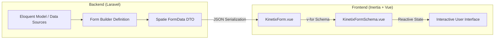
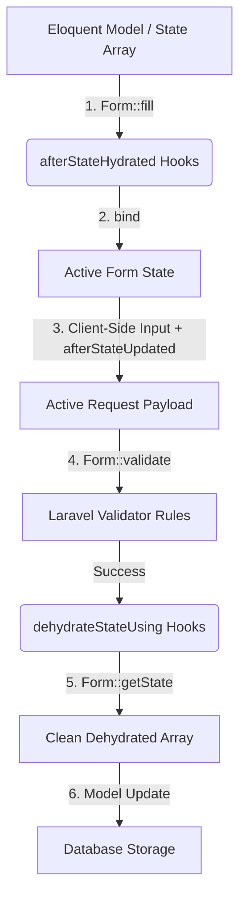

# Kinetix Forms Complete Reference

Kinetix Forms is a schema-driven, DTO-powered form building system built specifically for Vue 3, Inertia.js 3, and Tailwind CSS. By defining form structures, layouts, validation, and lifecycles in PHP, you serialize configurations into structured JSON DTOs that are natively consumed by premium Vue 3 elements.

---

## 1. Core Architecture & Concept

Kinetix Forms decouples form configuration from layout rendering. Instead of writing verbose HTML templates with complex binding logic, you define the entire layout, validation rules, default states, and visibility settings in PHP. 



### Key Principles
1. **Declarative Layouts**: Responsive columns, cards, and layouts are defined through a fluent API.
2. **TypeScript Generation**: Serialized data structure maps to typescript types generated via Spatie's Laravel TypeScript Transformer.
3. **Tailwind JIT Compliance**: Layout columns are computed using CSS custom properties or inline styles rather than dynamic Tailwind classes, avoiding purge and compilation errors.
4. **Unified Validation**: Frontend validation errors map to standard Laravel Validator keybags, maintaining unified error rendering.

---

### Defining a Form as a Class
As an alternative to the inline `->schema([...])` builder, subclass `Form` and override the `buildSchema()` hook. The hook runs in the constructor, so the schema is ready as soon as the form is instantiated.

```php
use Happones\Kinetix\Forms\Form;
use Happones\Kinetix\Forms\Components\TextInput;

class ProfileForm extends Form
{
    protected function buildSchema(): array
    {
        return [
            TextInput::make('name')->required()->maxLength(100),
            TextInput::make('email')->email()->required(),
        ];
    }
}
```

### One-Call Rendering

<Screenshot name="form-schema" alt="A schema-driven form: section, grid, inputs, select, toggle" />
`Form::render(?Model $record = null)` is a static helper that instantiates the form, fills it (from the passed model, or the given fill data), and returns the serialized array in one call:

```php
return inertia('Settings/Profile', [
    'profileForm' => ProfileForm::render($user),
]);
```

---

## 2. Forms Lifecycle & State Management

Form fields follow a strict lifecycle of data transformation during hydration (filling the form) and dehydration (extracting submitted state).



### 1. Hydration
Hydration extracts properties from a model or an array and binds them to the corresponding form fields. This occurs when you call `$form->fill($data)`.

#### Hydration Callbacks
- **`afterStateHydrated(Closure $callback)`**: Executed immediately after a field is populated. The closure receives the raw state value, the field component instance, and the source record (if a Model was passed):
  ```php
  TextInput::make('username')
      ->afterStateHydrated(function (mixed $state, Field $component, ?Model $record) {
          $component->default(strtolower((string) $state));
      });
  ```
- **`afterStateUpdated(Closure $callback)`**: Executed when the field's value changes on the client. Combine with **`live(bool $onBlur = false, ?int $debounce = null)`** to make the field reactive (push updates on change / blur / debounced):
  ```php
  TextInput::make('first_name')
      ->live(debounce: 500)
      ->afterStateUpdated(function (mixed $state, Field $component) {
          // react to the new value
      });
  ```

### 2. Dehydration
Dehydration processes user inputs, validates them, and transforms the states into database-compatible formats when you call `$form->getState($requestData)`.

#### Dehydration Callbacks
- **`dehydrateStateUsing(Closure $callback)`**: Transforms the submitted value before it is returned in the final state array:
  ```php
  TextInput::make('slug')
      ->dehydrateStateUsing(fn (string $state): string => str($state)->slug()->toString());
  ```
- **`saved(bool $condition)`**: Instructs the form whether to include the field's value in the output of `$form->getState()`. For example, presentational helper inputs (like passwords confirmations) should be validated but omitted:
  ```php
  TextInput::make('password_confirmation')
      ->password()
      ->saved(false); // Validated on request, but excluded from database update payloads
  ```

---

## 3. Form Layouts & Containers

Layout elements organize fields inside grids and visual groupings. They inherit column spans and conditional visibility parameters.

### 1. Grid
The `Grid` component creates a multi-column responsive layout. By default, it operates on a **12-column grid**.

<Screenshot name="layout-grid" alt="Grid layout" />

```php
use Happones\Kinetix\Forms\Components\Grid;
use Happones\Kinetix\Forms\Components\TextInput;

Grid::make(12)
    ->schema([
        TextInput::make('first_name')->columnSpan(6),
        TextInput::make('last_name')->columnSpan(6),
    ])
```

#### Tailwind Grid-Purge Prevention
To ensure column layouts render correctly without depending on dynamic Tailwind compiler classes (which JIT compilers purge), Kinetix evaluates `columnSpan` parameters into inline CSS styles:
- **`columnSpan(int)`**: Renders inline `grid-column: span X / span X`.
- **`columnSpan('full')`**: Renders inline `grid-column: 1 / -1`.

### 2. Section Cards
The `Section` component wraps nested elements in a clean visual container complete with title, description, and column layouts.

```php
use Happones\Kinetix\Forms\Components\Section;

Section::make('General Profile')
    ->description('Enter your public accounts info.')
    ->columns(2) // Implicitly maps inside fields to a 2-column grid
    ->schema([
        TextInput::make('display_name'),
        TextInput::make('twitter_handle'),
    ])
```

### 3. Fieldset
A lighter labelled grouping than `Section` — a bordered `<fieldset>` with a `<legend>`, no card chrome. Supports `columns()` and nesting.

<Screenshot name="layout-fieldset" alt="Fieldset layout" />

```php
use Happones\Kinetix\Forms\Components\Fieldset;

Fieldset::make('Address')
    ->columns(6)
    ->schema([
        TextInput::make('city')->columnSpan(4),
        TextInput::make('zip')->columnSpan(2),
    ])
```

### 4. Tabs
A tabbed container (Reka UI). Each `Tab` holds its own schema and may carry an `icon()` (any [Kinetix icon name](/actions#icons)). Fields inside every tab are still validated and saved — switching tabs is purely visual.

<Screenshot name="layout-tabs" alt="Tabs layout" />

```php
use Happones\Kinetix\Forms\Components\Tabs;
use Happones\Kinetix\Forms\Components\Tab;

Tabs::make()->tabs([
    Tab::make('Profile')->schema([
        TextInput::make('name'),
    ]),
    Tab::make('Security')->icon('settings')->schema([
        TextInput::make('password'),
    ]),
])
```

### 5. Split
A responsive flex row: children sit side-by-side from the `md` breakpoint and stack on small screens.

<Screenshot name="layout-split" alt="Split layout" />

```php
use Happones\Kinetix\Forms\Components\Split;

Split::make([
    TextInput::make('first_name'),
    TextInput::make('last_name'),
])
```

### 6. Placeholder
A read-only display block (label + content). It holds no field state and is never validated or saved — handy for showing computed/derived info inside a form.

<Screenshot name="layout-placeholder" alt="Placeholder (read-only) field" />

```php
use Happones\Kinetix\Forms\Components\Placeholder;

Placeholder::make('Account ID')
    ->content(fn ($record) => $record?->id ?? '—')
```

All layout components share the base `columnSpan()`, `visible()/hidden()` and `visibleOn()/hiddenOn()` methods, and nest arbitrarily.

### 7. Wizard
Break a form into validated steps with `Wizard::make()->steps([Step::make(...)])`. Advancing is gated on the current step's required fields. Also available as a standalone page component with gating middleware — see the dedicated [Wizard](/wizard) guide.

```php
use Happones\Kinetix\Forms\Components\Wizard;
use Happones\Kinetix\Forms\Components\Step;

Wizard::make()
    ->variant('gradient')
    ->steps([
        Step::make('Account')->schema([TextInput::make('email')->required()]),
        Step::make('Profile')->icon('user')->schema([TextInput::make('name')]),
    ])
```

---

## 4. Fields & Form Inputs API

Fields reside in the `Happones\Kinetix\Forms\Components` namespace. They all inherit from the base `Field` class, providing rich configuration options:

### Shared Field Methods
- `label(string|Closure $label)`: Customizes field title. If omitted, Kinetix translates the column name into a TitleCase Headline.
- `default(mixed $value|Closure $value)`: Set initial fallback state.
- `disabled(bool|Closure $condition = true)`: Prevent input mutations.
- `placeholder(string|Closure $placeholder)`: Visual watermark.
- `prefix(string|Closure $prefix)`: Prepends a label prefix.
- `suffix(string|Closure $suffix)`: Appends a label suffix.
- `extraInputAttributes(array $attributes)`: Custom HTML attributes merged onto the input element.
- `extraAttributes(array $attributes)`: Custom HTML attributes merged onto the field's outer container.
- `extraFieldWrapperAttributes(array $attributes)`: Custom HTML attributes merged onto the field wrapper (label + control group).

---

### 1. `TextInput`
Renders an HTML `<input>` tag. Supports several semantic modifications:

```php
use Happones\Kinetix\Forms\Components\TextInput;

TextInput::make('user_email')
    ->email() // sets type="email"
    ->required()
    ->placeholder('you@example.com');
```

#### Type Modifiers
- `password()`: Changes type to `password` to conceal characters.
- `email()`: Sets input type to `email` for device keyboards.
- `numeric()`: Enforces numeric keyboard and appends `numeric` validation rule.
- `url()`: Sets type to `url` and registers `url` validation.

---

### 2. `Select`

<Screenshot name="select" alt="Select field" />
Renders an HTML dropdown `<select>`. Supports static arrays, closures, and direct PHP Enum reflections.

```php
use Happones\Kinetix\Forms\Components\Select;
use App\Enums\UserRole;

Select::make('role')
    ->options(UserRole::class)
    ->required();
```

#### Option Resolvers
- **Enum Reflection**: Pass the classname of any Enum. If it implements the `HasLabel` contract, Kinetix maps case values to returned labels automatically.
- **Array Mapping**: Pass a simple key-value array:
  ```php
  Select::make('tier')
      ->options([
          'free' => 'Free Tier',
          'pro' => 'Professional Account',
      ]);
  ```
- **Closure Resolver**: Evaluate options dynamically based on the current model record:
  ```php
  Select::make('manager_id')
      ->options(fn (?User $record) => User::where('id', '!=', $record?->id)->pluck('name', 'id')->toArray());
  ```

#### Searchable (combobox)

Call `->searchable()` to render the field as a **combobox with a search box**
(Reka UI Combobox) instead of a plain dropdown. With only `options()`, the search
filters them **client-side**:

```php
Select::make('country')->searchable()->options($countries);
```

For large datasets, search a model **remotely** with `->searchUsing()` — the
client queries the server as you type (**debounced + lazy**, fetched only when the
field is opened), so you never ship thousands of options:

```php
Select::make('author_id')
    ->searchable()
    ->searchUsing(
        model: \App\Models\Author::class,
        labelColumn: 'name',
        searchColumns: ['name', 'email'],   // columns the server LIKE-matches
        valueColumn: 'id',
    );
```

The model + columns are encrypted into a signed token (the query string can never
name an arbitrary table/column — same guard as inline table edits), and the
currently-selected option's label is resolved server-side so it shows immediately.
Remote search hits `POST {prefix}/forms/search`.

---

### 3. `Checkbox`
Renders a custom toggle checkbox. To match design standards, it automatically maps to our custom frontend `<KinetixCheckbox>` component instead of browser default checkboxes.

```php
use Happones\Kinetix\Forms\Components\Checkbox;

Checkbox::make('terms_accepted')
    ->label('I accept the license agreement')
    ->required();
```

---

### 4. `Toggle`
Renders a modern, animated toggle switch. Perfect for binary configurations.

```php
use Happones\Kinetix\Forms\Components\Toggle;

Toggle::make('is_active')
    ->label('Account Status')
    ->default(true);
```

---

### 5. `Textarea`
Renders an HTML `<textarea>` for multi-line inputs.

```php
use Happones\Kinetix\Forms\Components\Textarea;

Textarea::make('bio')
    ->rows(4) // Adds row count attributes
    ->maxLength(500);
```

---

### 6. `DatePicker` & `DateTimePicker`

Both render the **shadcn calendar by default** (Reka UI popover) — `DatePicker` a single-date calendar, `DateTimePicker` a calendar plus scrollable hour/minute button columns. Call `->native()` to fall back to a plain native `<input type="date">` / `datetime-local`.

<Screenshot name="calendar" alt="Date picker calendar" />

`DateTimePicker` (popover open) — calendar + hour/minute columns:

<Screenshot name="datetime-picker" alt="Date-time picker showing the calendar and time columns" />

```php
use Happones\Kinetix\Forms\Components\DatePicker;
use Happones\Kinetix\Forms\Components\DateTimePicker;

DatePicker::make('published_at')->locale('es');          // shadcn calendar
DatePicker::make('published_at')->native();              // native input

DateTimePicker::make('scheduled_at')
    ->label('Schedule Release')
    ->minuteStep(15)     // 15-minute increments
    ->twelveHour();      // 12h clock with an AM/PM column
```

| Method | Applies to | Description |
|---|---|---|
| `->native()` | both | Render the native input instead of the shadcn calendar |
| `->locale(string)` | both | BCP-47 calendar locale (`'es'`, `'fr'`, `'en-US'`) |
| `->minuteStep(int)` | DateTimePicker | Minute granularity for the time column (default 5) |
| `->twelveHour()` | DateTimePicker | 12-hour clock with an AM/PM column |

---

### `TimePicker`
A **time-only** field (no date). Renders an input-style trigger that opens a
popover with scrollable hour/minute (+ AM/PM) columns, storing an `H:i` string
(e.g. `"14:30"`). **Defaults to a 12-hour clock with AM/PM** — call
`->twentyFourHour()` for 24-hour. `->native()` renders `<input type="time">`.

<Screenshot name="time-picker" alt="Time picker — input trigger + popover columns" />

```php
use Happones\Kinetix\Forms\Components\TimePicker;

TimePicker::make('opens_at');                       // 12h + AM/PM (default)
TimePicker::make('opens_at')->twentyFourHour();     // 24h clock
TimePicker::make('opens_at')->minuteStep(15);       // 15-minute increments
TimePicker::make('opens_at')->native();             // native <input type="time">
```

---

### `MonthPicker`, `YearPicker` & `WeekPicker`
Coarser date pickers. Each renders a **shadcn popover** by default and accepts
`->native()` for the browser-native input, plus `->minValue()` / `->maxValue()`
bounds (mapped to the native `min`/`max`).

| Field | Stores | Shadcn UI | Native input |
|---|---|---|---|
| `MonthPicker` | `Y-m` (`"2026-06"`) | month grid + year nav | `<input type="month">` |
| `YearPicker` | `Y` (`"2026"`) | paginated year grid | `<input type="number">` |
| `WeekPicker` | `o-\WW` (`"2026-W25"`) | calendar — clicking a day highlights its **whole week** | `<input type="week">` |

<Screenshot name="month-picker" alt="Month picker" />

<Screenshot name="year-picker" alt="Year picker" />

<Screenshot name="week-picker" alt="Week picker" />

```php
use Happones\Kinetix\Forms\Components\{MonthPicker, YearPicker, WeekPicker};

MonthPicker::make('billed_month')->minValue('2026-01')->maxValue('2026-12');
YearPicker::make('fiscal_year')->minValue('2020')->maxValue('2030');
WeekPicker::make('sprint')->startWeek(0);   // week starts Sunday (0=Sun … 6=Sat)
WeekPicker::make('sprint')->native();       // native <input type="week">
```

> `WeekPicker` / `WeekFilter` take `->startWeek(int)` (0=Sunday … 6=Saturday,
> default Monday) since the first day of the week is region-dependent.

> The same three are available as **table filters** — see
> [Tables → Filters](/tables#filters) (`MonthFilter`, `YearFilter`, `WeekFilter`).

---

### `DateRangePicker`
Pick a start + end date. Stores `{ from, to }` (each an ISO `Y-m-d` string). Renders
the shadcn **range calendar** in a popover by default, or **two native date
inputs** via `->native()`. Supports `->numberOfMonths()`, `->weekdayFormat()`,
`->fixedWeeks()`, `->locale()`, and `->minValue()` / `->maxValue()` bounds.

<Screenshot name="date-range-picker" alt="Date range picker" />

```php
use Happones\Kinetix\Forms\Components\DateRangePicker;

DateRangePicker::make('period')->numberOfMonths(2);
DateRangePicker::make('period')->minValue('2026-01-01')->maxValue('2026-12-31');
DateRangePicker::make('period')->native();   // two native <input type="date">
```

Persist `{from,to}` to a JSON-cast column, or split it in a `dehydrateStateUsing()`
callback. As a **table filter**, use `DateRangeFilter` (see
[Tables → Filters](/tables#filters)).

---

### 7. `Hidden`
Tracks form values that must be submitted to the backend without displaying them to the user.

```php
use Happones\Kinetix\Forms\Components\Hidden;

Hidden::make('referrer_id')
    ->default(fn () => request('ref'));
```

### 8. `Radio`

<Screenshot name="radio-group" alt="Radio group" />
A single-choice radio group. Extends `Select`, so it shares the same `options()` API — including automatic PHP Enum reflection.

```php
use Happones\Kinetix\Forms\Components\Radio;

Radio::make('plan')
    ->options(['free' => 'Free', 'pro' => 'Pro', 'team' => 'Team'])
    ->default('free');

// Enum-backed, laid out horizontally
Radio::make('status')
    ->options(PostStatus::class)
    ->inline();
```

| Method | Description |
|---|---|
| `->options(array\|Closure\|string)` | Choices map, closure, or Enum class (inherited from `Select`) |
| `->inline(bool = true)` | Lay options out horizontally instead of stacked |

### 9. `CheckboxList`
A multi-choice list whose value is an **array** of the selected keys. Extends `Select` for option handling. Pair it with an `array` cast (or JSON column) on the model.

```php
use Happones\Kinetix\Forms\Components\CheckboxList;

CheckboxList::make('permissions')
    ->options([
        'posts.create' => 'Create posts',
        'posts.delete' => 'Delete posts',
    ])
    ->inline();
```

| Method | Description |
|---|---|
| `->options(array\|Closure\|string)` | Choices map, closure, or Enum class (inherited from `Select`) |
| `->inline(bool = true)` | Lay checkboxes out horizontally instead of stacked |

### 10. `ColorPicker`
A native color swatch paired with a hex text input. The stored value is the hex string (e.g. `#4f46e5`).

```php
use Happones\Kinetix\Forms\Components\ColorPicker;

ColorPicker::make('brand_color')
    ->default('#4f46e5');
```

### 11. `TagsInput`

<Screenshot name="tags-input" alt="Tags input" />
A free-text tag editor. The stored value is an **array of strings**. Type and press <kbd>Enter</kbd> or `,` to add a tag; <kbd>Backspace</kbd> on an empty input removes the last tag. Pair it with an `array` cast.

```php
use Happones\Kinetix\Forms\Components\TagsInput;

TagsInput::make('skills')
    ->placeholder('Add a skill and press Enter');
```

Local typing state is encapsulated in the dedicated `KinetixTagsInput.vue` component, so the buffer never leaks across fields.

### 12. `KeyValue`

<Screenshot name="key-value" alt="Key-value field" />
An editable map of key/value string pairs. The stored value is an **associative array** (object). Pair it with an `array` cast.

```php
use Happones\Kinetix\Forms\Components\KeyValue;

KeyValue::make('metadata');
```

Row labels (`Key`, `Value`, `Add row`) come from the `kinetix` i18n namespace. Rendering and local row state live in `KinetixKeyValue.vue`, which resyncs from the parent only when the external value differs — avoiding an emit→prop feedback loop.

### 13. `Repeater`
Repeats a sub-schema over a list of items. The stored value is an **array of objects**, one per item. Pair it with an `array` cast (or a JSON column). Items can be added, removed, and reordered.

```php
use Happones\Kinetix\Forms\Components\Repeater;
use Happones\Kinetix\Forms\Components\TextInput;
use Happones\Kinetix\Forms\Components\Select;

Repeater::make('line_items')
    ->schema([
        TextInput::make('description')->columnSpan(8)->required(),
        TextInput::make('quantity')->numeric()->columnSpan(2),
        Select::make('unit')->options(['ea' => 'each', 'kg' => 'kg'])->columnSpan(2),
    ])
    ->minItems(1)
    ->maxItems(20)
    ->addActionLabel('Add line item');
```

| Method | Description |
|---|---|
| `->schema(array)` | The fields repeated for each item |
| `->minItems(int)` | Minimum items (disables removing below it) |
| `->maxItems(int)` | Maximum items (disables adding above it) |
| `->addActionLabel(string)` | Custom "add" button label (defaults to `kinetix.add_item`) |

**Architecture note:** `KinetixFormSchema` renders each item by recursing into itself with the item object as its scoped `values`, so any field type — including nested `Grid`/`Section` — works inside a repeater. New blank items are seeded from each sub-field's `defaultValue`. Validation treats the repeater as a single array-valued field (per-item rules are not auto-expanded in this version).

### 14. `FileUpload`

<Screenshot name="file-upload" alt="File upload dropzone" />
Uploads files to a storage disk and stores the resulting **path** (a string, or an array of strings when `multiple()`). Uploads happen immediately via a dedicated endpoint; the field value is the stored path(s).

```php
use Happones\Kinetix\Forms\Components\FileUpload;

FileUpload::make('avatar')
    ->image()
    ->disk('public')
    ->directory('avatars')
    ->maxSize(1024); // KB

FileUpload::make('attachments')
    ->multiple()
    ->maxFiles(5)
    ->acceptedFileTypes(['application/pdf', 'docx'])
    ->directory('docs');
```

| Method | Description |
|---|---|
| `->disk(string)` | Storage disk; defaults to the global `kinetix.filesystem.disk` (`public`). Set to any disk (e.g. `s3`). |
| `->directory(string)` | Target directory (default `uploads`) |
| `->multiple(bool = true)` | Accept multiple files (value becomes an array) |
| `->image()` | Restrict to images and render thumbnail previews |
| `->acceptedFileTypes(array)` | MIME types (`image/png`) and/or extensions (`pdf`) |
| `->maxSize(int)` | Max size per file in kilobytes |
| `->maxFiles(int)` | Max number of files (multiple mode) |

**Security:** the storage config (disk, directory, constraints) is signed into an encrypted `uploadToken` sent to the client; the upload endpoint (`uploads/store`) decrypts it, re-validates the file against the constraints, and stores it — the client can never choose an arbitrary disk/directory. A matching `uploads/delete` endpoint removes a file, constrained to the configured directory. Rendering and upload state live in `KinetixFileUpload.vue`. Pre-existing values render their preview via the `public` disk URL convention (`/storage/{path}`) or any absolute URL.

---

## 5. Operations & Visibility Constraints

You can restrict field rendering based on the type of operation (e.g. `'create'` or `'edit'`) or active database record properties.

### Setting the Operation & Model
The operation is inferred automatically when you pass a model (`'edit'` if the record `exists`, otherwise `'create'`). You can set both explicitly on the `Form`, which is what `visibleOn` / `hiddenOn` evaluate against:

- **`Form::operation(string $operation)`**: Force the active operation (e.g. `->operation('edit')`).
- **`Form::model(string $model)`**: Set the target model class (FQCN) when no model instance is passed.

```php
Form::make()
    ->model(User::class)
    ->operation('create')
    ->schema([ /* ... */ ]);
```

### Operation Restrictions
- **`hiddenOn(string|array $operations)`**: Hides the field on specified operations:
  ```php
  TextInput::make('password')
      ->hiddenOn('edit'); // Password cannot be edited from this form
  ```
- **`visibleOn(string|array $operations)`**: Only displays the field during specified actions:
  ```php
  TextInput::make('reset_token')
      ->visibleOn('create');
  ```

### Closure Evaluators
Provide dynamic rules evaluated on the server using closures.
- **`hidden(Closure|bool $condition)`**: Hide dynamically.
- **`visible(Closure|bool $condition)`**: Show dynamically.

```php
TextInput::make('billing_vat_id')
    ->visible(fn (?Order $record) => $record && $record->requires_vat);
```

---

## 6. Form Validation

Kinetix automatically generates standard Laravel validator arrays. This guarantees that your backend and frontend validation remain synchronized without duplicating validation logic.

### 1. Built-in Validation Rules
Chaining these methods on fields automatically populates the validation rules array:

| Method | Generated Laravel Rule |
|---|---|
| `required()` | `required` |
| `numeric()` | `numeric` |
| `email()` | `email` |
| `url()` | `url` |
| `maxLength(int $length)` | `max:{$length}` |
| `minLength(int $length)` | `min:{$length}` |

### 2. Conditional `required`
`required()` also accepts a closure, evaluated on the server against the current record. The field is only required when the closure returns truthy:

```php
TextInput::make('vat_id')
    ->required(fn (?Order $record) => $record && $record->requires_vat);
```

### 3. Appending Custom Validation Rules
For advanced validation scenarios (such as conditional checking, database uniqueness, or custom rule objects), append them using `rules()`:

```php
use Illuminate\Validation\Rules\Password;

TextInput::make('password')
    ->required()
    ->rules([
        'string',
        Password::min(8)->mixedCase()->numbers(),
    ]);
```

### 4. Controller Execution
Run the validation directly using the `$form->validate($request->all())` helper:

```php
public function store(Request $request)
{
    $form = $this->getForm();

    // Runs validation, throwing a standard ValidationException on failure
    $validated = $form->validate($request->all());

    // Retrieve clean, dehydrated data
    $data = $form->getState($request->all());

    User::create($data);

    return redirect()->route('users.index');
}
```

---

## 7. Complete Integration Guide

Here is a full integration walkthrough showcasing a production-ready user profile update setup.

### 1. The Controller (`App\Http\Controllers\ProfileController.php`)

```php
namespace App\Http\Controllers;

use App\Models\User;
use App\Enums\UserRole;
use Happones\Kinetix\Forms\Form;
use Happones\Kinetix\Forms\Components\Grid;
use Happones\Kinetix\Forms\Components\Section;
use Happones\Kinetix\Forms\Components\TextInput;
use Happones\Kinetix\Forms\Components\Select;
use Happones\Kinetix\Forms\Components\Toggle;
use Happones\Kinetix\Forms\Components\Textarea;
use Illuminate\Http\Request;
use Illuminate\Validation\Rule;

class ProfileController extends Controller
{
    /**
     * Define the form schema blueprint
     */
    protected function getProfileForm(User $user): Form
    {
        return Form::make($user)
            ->schema([
                Section::make('Public Profile')
                    ->description('This information will be displayed publicly.')
                    ->columns(12)
                    ->schema([
                        TextInput::make('name')
                            ->required()
                            ->maxLength(100)
                            ->columnSpan(6),

                        TextInput::make('email')
                            ->email()
                            ->required()
                            ->rules([
                                Rule::unique('users', 'email')->ignore($user->id),
                            ])
                            ->columnSpan(6),

                        Textarea::make('bio')
                            ->placeholder('Tell us about yourself...')
                            ->rows(3)
                            ->columnSpan('full'),
                    ]),

                Section::make('System Administration')
                    ->description('Internal system parameters.')
                    ->columns(12)
                    ->schema([
                        Select::make('role')
                            ->options(UserRole::class)
                            ->required()
                            ->columnSpan(6),

                        Toggle::make('is_active')
                            ->label('Active Status')
                            ->default(true)
                            ->columnSpan(6),
                    ]),
            ]);
    }

    /**
     * Show the edit view
     */
    public function edit(Request $request)
    {
        $user = $request->user();
        
        // Prepare the form and hydrate data from model
        $form = $this->getProfileForm($user)->fill($user);

        return inertia('Settings/Profile', [
            // Convert to Spatie DTO array for Inertia delivery
            'profileForm' => $form->toArray(),
        ]);
    }

    /**
     * Process the updates
     */
    public function update(Request $request)
    {
        $user = $request->user();
        $form = $this->getProfileForm($user);

        // 1. Validate inputs
        $form->validate($request->all());

        // 2. Obtain validated, dehydrated data
        $data = $form->getState($request->all());

        // 3. Update the Model
        $user->update($data);

        return redirect()->back()->with('message', 'Profile updated successfully.');
    }
}
```

### 2. The Vue 3 Component (`resources/js/pages/Settings/Profile.vue`)

```vue
<script setup lang="ts">
import { router } from '@inertiajs/vue3';
import KinetixForm from '@/components/kinetix/KinetixForm.vue';

const props = defineProps<{
    profileForm: any;
}>();

const handleFormSubmit = (formValues: Record<string, any>) => {
    // Send submission payload to the update route using Inertia
    router.put('/settings/profile', formValues, {
        preserveScroll: true,
        onSuccess: () => {
            // Success feedback trigger
        },
    });
};
</script>

<template>
    <div class="max-w-4xl mx-auto py-10 px-4 sm:px-6 lg:px-8">
        <div class="space-y-6">
            <div>
                <h1 class="text-2xl font-bold tracking-tight text-neutral-900 dark:text-white">
                    Account Settings
                </h1>
                <p class="mt-1 text-sm text-neutral-500 dark:text-neutral-400">
                    Manage your personal profile and account preferences.
                </p>
            </div>

            <!-- Kinetix Form Component -->
            <KinetixForm 
                :form="profileForm" 
                @submit="handleFormSubmit"
            >
                <!-- Custom Action buttons (replaces default submit button) -->
                <template #default="{ values }">
                    <div class="flex items-center gap-3">
                        <button
                            type="submit"
                            class="px-4 py-2 text-sm font-semibold rounded-lg shadow bg-indigo-600 hover:bg-indigo-500 text-white transition-colors"
                        >
                            Save Settings
                        </button>
                        
                        <button
                            type="button"
                            @click="router.get('/dashboard')"
                            class="px-4 py-2 text-sm font-semibold rounded-lg border border-neutral-300 dark:border-neutral-700 bg-transparent text-neutral-700 dark:text-neutral-300 hover:bg-neutral-100 dark:hover:bg-neutral-800 transition-colors"
                        >
                            Cancel
                        </button>
                    </div>
                </template>
            </KinetixForm>
        </div>
    </div>
</template>
```
