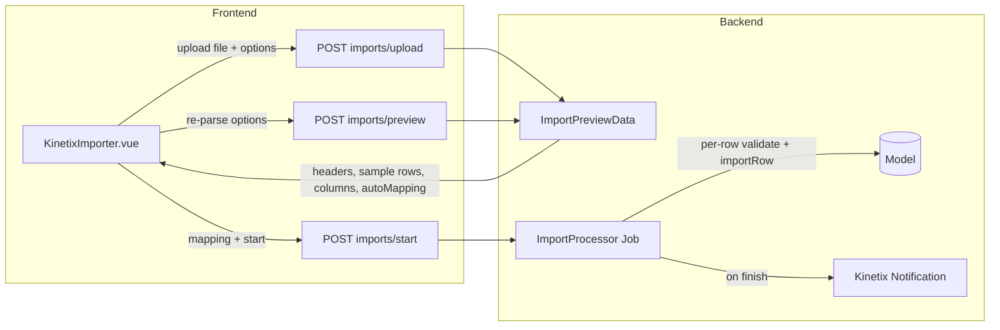

# Kinetix Import / Export

A queue-backed import pipeline with a **three-step wizard**: choose a file, confirm the column mapping Kinetix guessed for you, review a sample and start. The import runs on the queue and notifies the user when it finishes.

It is built to stay cheap on files of any size. Previewing reads a **sample**, never the file: the reader stops at the configured row limit, the row count is counted rather than parsed, and the queued job **streams** the file row by row. A million-row upload costs the dialog the same as a ten-row one.

> Excel (`.xls`/`.xlsx`) support uses `phpoffice/phpspreadsheet`. CSV/TSV are parsed natively.
> **Export** is documented in §7.

---

## 1. Architecture



| Piece | Responsibility |
|---|---|
| `Importer` (abstract) | Declares target columns, the model, per-row import, queue/chunk config |
| `ImportColumn` | A target column: label, required, rules, alias guesses, value casting |
| `FileReader` | Streams CSV (native) and Excel (phpspreadsheet) — bounded, never whole-file |
| `ImportController` | `upload` / `preview` / `start` endpoints |
| `ImportProcessor` | Queued job: streams rows, validates, imports, notifies, cleans up |
| `KinetixImporter.vue` | The wizard (file → mapping → review), and its subcomponents in `components/Importer/` |
| `KinetixImportModal.vue` | Picks the dialog surface (modal / full-screen modal / sheet) |

---

## 2. Defining an Importer

```php
namespace App\Kinetix\Importers;

use App\Models\Contact;
use Happones\Kinetix\Imports\Importer;
use Happones\Kinetix\Imports\ImportColumn;

class ContactImporter extends Importer
{
    protected static ?string $model = Contact::class;

    public static function getColumns(): array
    {
        return [
            ImportColumn::make('name')
                ->guess(['nombre', 'full name'])
                ->requiredMapping(),

            ImportColumn::make('email')
                ->guess(['e-mail', 'correo'])
                ->rules(['email'])
                ->castStateUsing(fn ($value) => strtolower(trim((string) $value))),

            ImportColumn::make('phone')
                ->guess(['celular', 'mobile', 'tel']),
        ];
    }

    // Optional: upsert instead of insert by resolving an existing record.
    public function resolveRecord(array $data): ?\Illuminate\Database\Eloquent\Model
    {
        return Contact::firstOrNew(['email' => $data['email'] ?? null]);
    }
}
```

### `ImportColumn` API

| Method | Description |
|---|---|
| `::make(string $name)` | Target attribute (matches the model column) |
| `->label(string)` | Display label (auto-generated from the name otherwise) |
| `->requiredMapping(bool = true)` | The user must map a source column before starting |
| `->rules(array\|string)` | Laravel validation rules applied per row |
| `->guess(array $aliases)` | Extra header names used for **automatic** mapping |
| `->castStateUsing(Closure)` | Transform the raw value before saving |
| `->fillRecordUsing(Closure)` | Custom write onto the record (`fn ($record, $value, $row)`) |

### `Importer` API

| Method | Description |
|---|---|
| `getColumns(): array` | The target columns (required) |
| `protected static $model` | The model written to (or override `resolveRecord()`) |
| `resolveRecord(array $data): ?Model` | Return an existing record for upsert; `null` inserts |
| `importRow(array $data): void` | Per-row handler (override for custom logic) |
| `chunkSize(): int` | Rows per DB transaction (default `1000`) |
| `queue(): ?string` | Queue the job runs on (default queue otherwise) |
| `context(Request $request): array` | Request context captured at dispatch, restored on the worker (see below) |
| `getContext(): array` / `$this->context` | Read the restored context inside `importRow()` / `resolveRecord()` |
| `token()` / `fromToken()` | Signed class token passed to/from the frontend |
| `ability(): ?string` | Policy ability required to run the import (null = `create` when the model has a policy) |
| `authorize(?Authenticatable $user): bool` | Override for custom authorization; enforced on every import endpoint |
| `protected bool $downloadableTemplate = true` | Offer a "Download template" link in the import modal |
| `protected ?string $templateFileName = null` | Template filename (null = studly class name, `ProductImporter.csv`) |
| `protected ?bool $preview = null` | Show the sample-data table (null inherits `kinetix.imports.preview`) |
| `protected ?int $previewRows = null` | Sample rows — **and the reader's ceiling** (null inherits config) |
| `protected ?int $previewColumns = null` | Columns shown before the rest fold away, `0` = no cap (null inherits config) |
| `protected ?string $layout = null` | `'auto'` \| `'modal'` \| `'fullscreen'` \| `'sheet'` (null inherits config) |
| `protected ?int $fullscreenThreshold = null` | Column count above which `'auto'` goes full screen |
| `protected ?int $maxUploadSize = null` | Upload ceiling in kilobytes (null inherits config) |
| `settings(): ImportSettingsData` | The resolved dialog settings sent to the frontend |
| `isExactMatch(array $headers, array $mapping): bool` | Whether the file lines up one-for-one (see below) |
| `getStartedNotificationBody(): string` | Toast shown when the import is queued (see [Notifications](#_8-notifications-lifecycle-custom-messages)) |
| `getCompletedNotificationTitle/Body(int $imported, int $failed): string` | Completion notification title/body |
| `getFailedNotificationTitle/Body(): string` | Whole-job failure notification title/body |

### Authorization

An import is a write primitive: it creates and updates records of the target
model. Every endpoint (`upload`, `preview`, `start`) therefore authorizes before
doing anything, so an importer token that reaches a lower-privileged user's page
can't be replayed into a bulk write.

By default the target model's `create` ability is required whenever it has a
policy. Narrow it, or take over entirely:

```php
class ProductImporter extends Importer
{
    protected static ?string $model = Product::class;

    // Require a specific ability instead of `create`.
    public function ability(): ?string
    {
        return 'import';
    }

    // …or decide yourself.
    public function authorize(?Authenticatable $user): bool
    {
        return $user?->hasRole('data-team') ?? false;
    }
}
```

::: warning No policy means no check
With no policy on the model, nothing is enforced here and the host owns access —
the same convention as record actions. Add a policy or override `authorize()`.
:::

### Downloadable template

The import modal shows a **Download template** link by default — a CSV whose
header row is the importer's column **labels**, which auto-map when the filled
file is uploaded back. Opt out or rename per importer:

```php
class ProductImporter extends Importer
{
    protected bool $downloadableTemplate = false;   // hide the link
    protected ?string $templateFileName = 'products.csv'; // default: ProductImporter.csv
}
```

Served by `GET {prefix}/imports/template?importer={token}`
(`kinetix.imports.template`) — 404 when the importer disables it. When opening
the modal manually (without `ImportAction`), pass the filename via the
`template` prop / event detail:

```js
window.dispatchEvent(new CustomEvent('kinetix:open-importer', {
    detail: { importer: token, template: 'products.csv' },
}));
```

### Multi-tenancy: carrying the request context into the queue

The queued job runs with **no HTTP request** — `auth()->user()`, the current
team, session, etc. are all unavailable. If `importRow()` needs tenant scoping
(almost always in a multi-tenant app), override `context()`: it is called **at
dispatch time** (inside the request), serialized with the job, and restored on
the worker instance before any row is imported.

```php
use Illuminate\Http\Request;

class ProductImporter extends Importer
{
    public function context(Request $request): array
    {
        return [
            'team_id' => $request->user()?->currentTeam?->getKey(),
            'user_id' => $request->user()?->getKey(),
        ];
    }

    public function importRow(array $data): void
    {
        Product::create([
            ...$data,
            'team_id' => $this->context['team_id'],   // never "the first team in the DB"
        ]);
    }
}
```

> **Warning**: without this, a queued importer that infers the tenant (e.g.
> `Team::first()`) is a real multi-tenant leak. Keep the returned array to
> serializable scalars — it travels through the queue payload.

### Smart auto-mapping

`Importer::guessMapping($headers)` matches each column against its name, label, and `guess()` aliases using a normalized comparison (case/spacing/punctuation insensitive — `NOMBRE` ≈ `name`). It is **collision-free**: each source header is claimed by at most one target column.

#### Exact matches skip the mapping step

`Importer::isExactMatch($headers, $mapping)` reports whether the file lines up
one-for-one: **every** target column found a header, and **every** (non-blank)
header was claimed. A file filled in from the downloadable template always
satisfies this — the template's header row *is* the column labels — so the
wizard says so and takes the user **straight to review**. Nothing was guessed,
so there is nothing to confirm.

It deliberately fails when a source column goes unclaimed: that column's data
would be silently dropped, which is exactly the case the user should see. The
mapping step names those columns explicitly ("2 source columns are not mapped
and will be ignored: …").

---

## 3. Scale: what actually gets read

An import file is allowed to be enormous, so every step is bounded:

| Step | Cost | Why |
|---|---|---|
| Preview | `previewRows` rows | The reader **stops** at the limit — a 10-row preview parses 10 rows on a 1M-row file |
| Row count | One pass, no parsing | CSV newlines are counted in 1 MB blocks; a spreadsheet reports its own row count via `listWorksheetInfo()`, with no cells loaded |
| Queued import | `chunkSize()` rows in memory | `FileReader::stream()` is a generator: the job holds one chunk, never the file |
| Failed rows | One row at a time | Skipped rows are written to the downloadable CSV as they happen, not collected |

Spreadsheets (`.xls`/`.xlsx`) have no streaming reader — loading one materializes
every cell — so they are read in **windows** of `spreadsheet_chunk_size` rows,
re-opening the file per window (`RowWindowFilter`). The **first** worksheet is
the one read.

::: tip The row count is a label, not a contract
It is intentionally cheap rather than exact: a CSV field containing a literal
newline counts more than once. The number labels the dialog ("1,204,882 rows
detected") — it never drives the import, which streams the real records.
:::

### Configuration

```php
// config/kinetix.php
'imports' => [
    'max_upload_size'        => env('KINETIX_IMPORT_MAX_UPLOAD_SIZE', 102400),   // KB
    'preview'                => env('KINETIX_IMPORT_PREVIEW', true),
    'preview_rows'           => env('KINETIX_IMPORT_PREVIEW_ROWS', 10),
    'preview_columns'        => env('KINETIX_IMPORT_PREVIEW_COLUMNS', 8),        // 0 = no cap
    'layout'                 => env('KINETIX_IMPORT_LAYOUT', 'auto'),
    'fullscreen_threshold'   => env('KINETIX_IMPORT_FULLSCREEN_THRESHOLD', 12),
    'spreadsheet_chunk_size' => env('KINETIX_IMPORT_SPREADSHEET_CHUNK', 2000),
],
```

Any importer overrides the lot per class:

```php
class WideProductImporter extends Importer
{
    protected ?int $previewRows = 5;        // sample 5 rows instead of 10
    protected ?int $previewColumns = 0;     // no column cap in the preview
    protected ?string $layout = 'fullscreen'; // always take the room
    protected ?int $maxUploadSize = 512000; // 500 MB, for a very large export dump
}

class SensitiveImporter extends Importer
{
    protected ?bool $preview = false;       // map the columns, never show the cells
}
```

`max_upload_size` is enforced on the upload endpoint (from the **importer**, not
the config, when it overrides it). PHP's own `upload_max_filesize` and
`post_max_size` still cap it — raise those first.

---

## 4. Endpoints

All under the configured Kinetix route prefix (default `_kinetix`), using the `web`+`auth` middleware:

| Route | Purpose |
|---|---|
| `GET {prefix}/imports/template` | Download the importer's CSV template (404 when disabled) |
| `POST {prefix}/imports/upload` | Store the file, return preview + auto-mapping |
| `POST {prefix}/imports/preview` | Re-parse the stored file with new CSV options |
| `POST {prefix}/imports/start` | Validate required mappings and dispatch the job |

The importer class travels as an encrypted token (`Importer::token()`), and the stored file is referenced by an encrypted `fileToken` constrained to the `kinetix-imports` directory.

---

## 5. Frontend

Pass the importer token to the page and render `KinetixImporter`:

```php
// Controller
return inertia('Contacts/Import', [
    'importer' => ContactImporter::token(),
]);
```

```vue
<script setup lang="ts">
import KinetixImporter from '@/components/kinetix/KinetixImporter.vue';
defineProps<{ importer: string }>();
</script>

<template>
    <KinetixImporter :importer="importer" />
</template>
```

### The three steps

| Step | What it holds |
|---|---|
| **1 · File** | Drop zone (also a real file input — drag-and-drop is never the only way in), the chosen file with its size, the **Download template** link, and the **Reading options** — collapsed, with the current settings still stated in its summary line |
| **2 · Mapping** | One labelled select per target column, pre-selected from the auto-mapping, with already-claimed source columns disabled so one source is never reused. Searchable, filterable to "unmapped only", resettable to the suggestions, with a `18 / 24 fields mapped` counter — and it names the source columns the import would otherwise silently drop |
| **3 · Review** | A summary (file, rows, mapped fields, ignored columns), the bounded sample table, and **Start import** |

A file that lines up one-for-one **skips step 2** and lands on review directly.
**Start import** stays disabled until every required column is mapped, and the
mapping step says how many are still missing.

<Screenshot name="importer-options" alt="The reading options expanded: delimiter, text enclosure and omit-lines on one aligned row, with the header-row checkbox on its own line" />

<Screenshot name="importer-mapping" alt="The mapping step: a labelled select per target column, a progress counter, and a note naming the source column that will be ignored" />

The reading options are a **`<KinetixCollapsible>`** primitive (`open` /
`defaultOpen` / `title` / `summary` / `bare` props, `#trigger` slot) — a shadcn
Collapsible built on Reka UI, animating its real height, reusable anywhere you
want a disclosure and not only here. Its field grid measures **its own** width
rather than the viewport's, which is the point: this form lives in a dialog
whose width does not follow the screen, so viewport breakpoints squeezed it into
columns the labels could not fit.

Why three steps rather than one panel: a single scrolling panel had to hold the
options, one select per column and a full-width preview at once, so a file with
twenty or more columns grew the dialog past the viewport and stranded its own
actions. Each step is bounded now, and the file's width only affects the step
actually showing it.

The pieces live in `components/Importer/` (`ImporterSteps`, `ImporterDropzone`,
`ImporterOptions`, `ImporterMapping`, `ImporterPreview`) with the state machine
in `composables/useKinetixImporter.ts`, so the wizard's steps stay
presentational.

### Where it renders: `surface`

`KinetixImporter` never assumes it owns the page, because what should scroll
depends on where it sits:

| `surface` | Who scrolls |
|---|---|
| `inline` (default) | The page. Use it for a wizard placed on a page of its own |
| `modal` | The wizard's own bounded scroller, capped so the dialog stays put |
| `fullscreen` | The wizard's scroller, filling the panel |
| `sheet` | Nobody new — `KinetixSheet` already scrolls its body |

`KinetixImportModal` sets this for you (below). Set it yourself only when you
place the wizard in a shell of your own.

### Quickest: the prebuilt `ImportAction`

`ImportAction::make()->importer(...)` opens the import preview in a dialog automatically — just mount the global `<KinetixImportModal />` once in your layout:

```php
use Happones\Kinetix\Actions\ImportAction;

$table->headerActions([
    ImportAction::make()->importer(ContactImporter::class),
]);
```

```vue
<!-- once, in your app layout -->
<KinetixImportModal />
```

Clicking the action fires `kinetix:open-importer` (with the importer as a signed token); `KinetixImportModal` catches it and renders `KinetixImporter` in a shadcn dialog. `ImportAction` is a normal `Action` (`->label()`/`->icon()`/`->authorize()`…). Give each a unique name when you have several: `ImportAction::make('importBrands')->importer(BrandImporter::class)`.

The event carries the importer's resolved `settings`, so the dialog can present
itself correctly before a file even exists.

### The dialog sizes itself to the file

One size does not fit every file: a three-column CSV is a dialog, a
twenty-four-column one needs the room. With the default `layout: 'auto'`, the
dialog **promotes itself to a full-screen modal** once the parsed file exceeds
`fullscreenThreshold` columns (12 by default).

It is the *same* `KinetixModal`, only bigger — the wizard is resized, never
remounted, so a mapping the user already adjusted survives the change.

| `layout` | Behaviour |
|---|---|
| `'auto'` (default) | Modal, promoting itself to full screen past the column threshold |
| `'modal'` | Always the normal dialog |
| `'fullscreen'` | Always full screen |
| `'sheet'` | An edge panel (`KinetixSheet`), decided **up front** |

::: tip Why `'sheet'` never escalates automatically
Swapping the modal for a sheet mid-flow means unmounting the wizard, which would
discard the file and the mapping the user already fixed. A sheet is therefore an
explicit per-importer choice, and the automatic escalation stays within one
component.
:::

```php
class WideProductImporter extends Importer
{
    protected ?string $layout = 'fullscreen';    // or 'sheet' / 'modal'
    protected ?int $fullscreenThreshold = 8;     // escalate sooner under 'auto'
}
```

### The sample table

Bounded on both axes, and both bounds are yours to set:

- **Rows** — `previewRows` (10). This is the *reader's* ceiling too, so it is
  literally how much of the file is parsed.
- **Columns** — `previewColumns` (8). The rest fold behind a
  *"Show N more columns"* toggle rather than turning the dialog into a
  horizontal scroll. `0` shows them all. The table scrolls inside its own
  container, so the dialog never scrolls sideways.
- **Off entirely** — `protected ?bool $preview = false`. The mapping still works
  (it only needs the headers); no cell values are shown or even parsed.

### Recipe (manual): open the importer from a table toolbar action

If you prefer to place the importer yourself (inline section, custom modal), use a plain action that fires a browser event and show `KinetixImporter` when the page hears it.

**1. Toolbar action** (on the table) dispatches an event instead of navigating:

```php
use Happones\Kinetix\Actions\Action;

$table->toolbarActions([
    Action::make('import')->label('Import')->icon('upload')->dispatch('open-importer'),
]);
```

**2. Pass the importer token** to the same page that renders the table:

```php
return inertia('Contacts/Index', [
    'table'    => ContactResource::table(Table::make(Contact::query()))->toArray(),
    'importer' => ContactImporter::token(),
]);
```

**3. The page** listens for `kinetix:open-importer` and shows the importer in a dialog. Use `KinetixModal` — it owns the focus trap, `Escape`, and the bounded panel — and tell the wizard which surface it is in, so it brings its own bounded scroller:

```vue
<script setup lang="ts">
import { computed, onBeforeUnmount, onMounted, ref } from 'vue';
import KinetixTable from '@/components/kinetix/KinetixTable.vue';
import KinetixImporter from '@/components/kinetix/KinetixImporter.vue';
import KinetixModal from '@/components/kinetix/primitives/KinetixModal.vue';

defineProps<{ table: any; importer: string }>();

const showImporter = ref(false);
const columns = ref(0);

const open = () => {
    columns.value = 0;
    showImporter.value = true;
};

onMounted(() => window.addEventListener('kinetix:open-importer', open));
onBeforeUnmount(() => window.removeEventListener('kinetix:open-importer', open));

// The same escalation `KinetixImportModal` does for you.
const fullscreen = computed(() => columns.value > 12);
</script>

<template>
  <KinetixTable :table="table" />

  <KinetixModal
    :open="showImporter"
    title="Import contacts"
    :max-width="fullscreen ? 'sm:max-w-[95vw]' : 'sm:max-w-3xl'"
    :fullscreen="fullscreen"
    @update:open="showImporter = $event"
  >
    <KinetixImporter
      :importer="importer"
      :surface="fullscreen ? 'fullscreen' : 'modal'"
      @update:columns="columns = $event"
      @started="showImporter = false"
      @cancel="showImporter = false"
    />
  </KinetixModal>
</template>
```

Emits worth wiring: `update:columns` (the parsed file's source-column count — what the escalation reads), `started` (the import was queued), `cancel` (the user backed out of step 1).

The import itself is queued; the user gets a completion **notification** when it finishes. Reload the table afterwards with `router.reload({ only: ['table'] })` (e.g. on a notification action or a manual refresh).

---

## 6. The Queued Job

`ImportProcessor` **streams** the file (`FileReader::stream()` is a generator, so the job holds one chunk of rows, never the file), maps each row by the chosen header indices, validates mapped columns against their `rules()`, calls `importRow()` per row inside chunked transactions, deletes the temp file, and finishes by sending a Kinetix notification:

- `Import complete` — `:imported imported, :failed skipped` (status `success`, or `warning` if any rows were skipped). A row that fails validation or whose `importRow()` throws is **skipped, never fatal** — the first 10 failures are listed in the notification body with their row number and reason.
- When any rows failed, the notification also carries a **Download failed rows** action: a CSV of **every** failed source row (row number, the original cells, and the reason), behind the same signed, user-bound, expiring download token exports use. Rows are written to it **as they fail**, so a wholly mismatched million-row file doesn't hold a million rows in worker memory on the way there.
- Sent via `broadcast()` when Echo is configured, otherwise persisted with `sendToDatabase()`.

Customize the dispatch by overriding `queue()` and `chunkSize()`, the whole per-row behaviour via `importRow()` / `resolveRecord()`, and every notification message via the `get*Notification*` hooks (see [Notifications](#_8-notifications-lifecycle-custom-messages)).

---

## 7. Export

A queued `Exporter` streams records (CSV) or builds a workbook (Excel) to storage, then sends the user a **download notification** carrying a signed, time-unguessable download link.

> **Storage disk.** Exports and the temporary import file both use `kinetix.filesystem.private_disk` (default `local`), **not** the public `kinetix.filesystem.disk` that serves uploads and image columns. Generated artifacts must not be reachable by URL: on a public disk they sit at a guessable `/storage/…` path with no authentication, which turns the token-guarded download route into a side door. Because CSV/XLSX read & write need a real local path, cloud disks are bridged automatically: exports write to a temp file then upload to the disk, and imports stream the file to a temp path for parsing (handled by `Happones\Kinetix\Support\KinetixDisk`). The signed download token carries the disk it was written to.

```mermaid
graph LR
    A[exporter->export($user)] --> J[ExportProcessor Job]
    J -->|query->chunk| W[FileWriter csv/xlsx]
    W --> F[(storage/kinetix-exports)]
    J -->|on finish| N[Notification + Download action]
    N -->|signed token| D[GET exports/download]
    D --> F
```

### Defining an Exporter

```php
namespace App\Kinetix\Exporters;

use App\Models\Contact;
use Happones\Kinetix\Exports\Exporter;
use Happones\Kinetix\Exports\ExportColumn;

class ContactExporter extends Exporter
{
    protected static ?string $model = Contact::class;

    public function format(): string
    {
        return 'xlsx'; // 'csv' (default), 'xlsx', or 'pdf'
    }

    public static function getColumns(): array
    {
        return [
            ExportColumn::make('name')->label('Full Name'),
            ExportColumn::make('email'),
            ExportColumn::make('created_at')
                ->label('Registered')
                ->formatStateUsing(fn ($value) => $value?->format('Y-m-d')),
        ];
    }

    // Optional: scope/filter what gets exported.
    public function query(): \Illuminate\Database\Eloquent\Builder
    {
        return Contact::query()->where('is_active', true);
    }
}
```

### Dispatching

```php
// Anywhere (controller, table toolbar action target, command):
(new ContactExporter())->export($request->user());
```

The export runs on the queue. When finished, the recipient gets a Kinetix notification (**Export ready**) with a **Download** action button. The link opens in a new tab and streams the file as an attachment.

### PDF exports

Return `'pdf'` from `format()` to produce a printable PDF (a landscape A4 table
of the exported rows, the first row as the header). PDF rendering uses the
optional **`dompdf/dompdf`** package — install it once:

```bash
composer require dompdf/dompdf
```

```php
public function format(): string
{
    return 'pdf';
}
```

If dompdf isn't installed, a PDF export fails fast with an install hint. `csv`
and `xlsx` need nothing extra.

### Quickest: the prebuilt `ExportAction`

No route or controller needed — `ExportAction::make()->exporter(...)` posts to a built-in endpoint (`kinetix.exports.start`) that dispatches the queued export and notifies the user. Drop it in the toolbar (exports the exporter's query) and/or as a bulk action (exports the selected rows — their ids are sent automatically):

```php
use Happones\Kinetix\Actions\ExportAction;

$table
    ->headerActions([                                  // toolbarActions() alias
        ExportAction::make()->exporter(ContactExporter::class),  // export all
    ])
    ->bulkActions([
        ExportAction::make()->exporter(ContactExporter::class),  // export selected
    ]);
```

**Bulk exports are scoped to the selected rows automatically** — `Exporter::resolveExportQuery()` narrows your `query()` to the selected `ids` (`whereKey`). You do **not** need to read `parameter('ids')` in `query()`; selecting 2 rows exports exactly those 2, and the toolbar/header copy (no selection) exports the whole `query()`. Override `query()` only to add your own base filters:

```php
public function query(): \Illuminate\Database\Eloquent\Builder
{
    return Contact::query()->where('active', true); // bulk ids are still applied on top
}
```

`ExportAction` is a normal `Action`, so `->label()`, `->icon()`, `->color()`, `->authorize()`, `->visible()` all apply. The exporter travels as a signed token; the built-in endpoint validates it and dispatches `(new Exporter())->export($request->user(), ['ids' => …])`.

> Note: the toolbar `ExportAction` exports the **exporter's `query()`**, not the table's *current* on-screen filters (those live only in the browser's query string). Scope what's exported in the exporter's `query()` / via parameters. The manual recipe below shows full control when you need it (e.g. a custom route reading filter values).

**Inside a relation manager** the same action is automatically **scoped to the
parent's relationship** — the export intersects your `query()` with the
relation's keys, so it ships only the parent's related records. See
[Relation Managers → Relation-scoped export](/relation-managers#relation-scoped-export).

### Recipe (manual): export from a table — toolbar (all) + bulk (selected)

When you need full control (custom route, applying the table's filters, extra options), wire it yourself: one **Export** button in the table toolbar that exports the whole table, and the **same** action as a bulk action that exports only the selected rows. The bulk invocation sends the selected `ids`; the exporter scopes its query to them.

**1. Scope the exporter by the selected ids** (no-op when none are passed):

```php
class ContactExporter extends Exporter
{
    protected static ?string $model = Contact::class;

    public static function getColumns(): array
    {
        return [ExportColumn::make('name'), ExportColumn::make('email')];
    }

    public function query(): \Illuminate\Database\Eloquent\Builder
    {
        return Contact::query()
            // Selected-rows export: only the ids the bulk action sent.
            ->when($this->parameter('ids'), fn ($q, $ids) => $q->whereKey($ids));
    }
}
```

**2. The export route** reads the (optional) ids and passes them to the exporter:

```php
Route::post('/contacts/export', function (Request $request) {
    (new ContactExporter())->export(
        $request->user(),                       // notification recipient
        ['ids' => $request->input('ids', [])],  // empty = whole table
    );

    return back(); // the file arrives via the "Export ready" notification
})->name('contacts.export');
```

**3. Wire the same action into the toolbar and bulk slots:**

```php
use Happones\Kinetix\Actions\Action;

$export = Action::make('export')
    ->label('Export')
    ->icon('download')
    ->inertiaVisit(route('contacts.export'), ['method' => 'post', 'preserveScroll' => true]);

$table
    ->toolbarActions([$export])  // exports the whole filtered table
    ->bulkActions([$export]);    // exports only the checked rows (sends `ids`)
```

How the `ids` travel: a **bulk** action automatically merges the selected ids into the request (`inertiaVisit` → `$request->input('ids')`; `dispatch` → `e.detail.ids`). The **toolbar/footer** copy sends none, so `parameter('ids')` is empty and the whole `query()` exports. Put `$export` in `footerActions([$export])` too if you want an "Export" at the bottom of the table.

> The `->export($recipient, $parameters)` parameters travel through the queued job (they must be serializable — ids, filter values, etc.) and are read inside `query()` via `$this->parameter('key')`.

### `Exporter` / `ExportColumn` API

| `Exporter` method | Description |
|---|---|
| `getColumns(): array` | The exported columns (required) |
| `protected static $model` / `query()` | Source records (override `query()` to filter) |
| `format(): string` | `'csv'` (default) or `'xlsx'` |
| `fileName(): string` | Download file name without extension |
| `chunkSize(): int` | Records per query chunk (default `1000`) |
| `queue(): ?string` | Queue the job runs on |
| `export(?Model $recipient, array $parameters = []): void` | Dispatch the queued export + notify the recipient. `$parameters` (e.g. `['ids' => [...]]`) reach the exporter inside the job |
| `parameter(string $key, $default = null)` | Read a runtime parameter inside `query()` (e.g. the selected `ids`) |
| `withParameters(array): static` | Set parameters on an instance (used by the job; `export()` is the usual entry point) |
| `getStartedNotificationBody(): string` | Toast shown when the export is queued (see [Notifications](#_8-notifications-lifecycle-custom-messages)) |
| `getCompletedNotificationTitle/Body(int $exported, int $failed): string` | Completion notification title/body |
| `getFailedNotificationTitle/Body(): string` | Whole-job failure notification title/body |

| `ExportColumn` method | Description |
|---|---|
| `::make(string $name)` | Source attribute (dot-notation aware, enum friendly) |
| `->label(string)` | Column heading |
| `->formatStateUsing(Closure)` | Transform the value (`fn ($value, $record)`) |

### Authorization

`Exporter::ability()` / `Exporter::authorize()` mirror the importer API and are
enforced by the export-start endpoint, defaulting to the model's `viewAny`
ability when it has a policy.

Scope the data in `query()`: a bulk export's selected `ids` are applied **on top
of** that query, so they can only ever narrow what it already allows — but a
default `query()` is unscoped.

```php
class InvoiceExporter extends Exporter
{
    protected static ?string $model = Invoice::class;

    public function query(): Builder
    {
        return Invoice::where('team_id', auth()->user()->currentTeam->getKey());
    }
}
```

### Download endpoint & security

`GET {prefix}/exports/download?token=…` (named `kinetix.exports.download`) streams the file. The token is an encrypted payload of the stored path + download name, constrained to the `kinetix-exports` directory, **bound to the user it was minted for** and expiring after `kinetix.exports.download_ttl` minutes (default 24h) — so a link that leaks out of a mailbox or a proxy log is not a standing grant. The route also sits behind the configured `web`+`auth` middleware.

> **Teams.** The export endpoints (`exports/start` and `exports/download`) are
> the one Kinetix group registered **without** the `{current_team}` prefix:
> both URLs are built server-side and token-signed, and the download link is
> generated inside a queued job, which has no team route context. Team scoping
> of the exported **data** belongs in the exporter's own `query()` (see the
> importer's multi-tenancy section — the same "carry the context into the
> queue" rule applies).

---

## 8. Notifications: lifecycle & custom messages

Wiring an `ExportAction` / `ImportAction` to a class is all it takes — the full
notification lifecycle is automatic:

| Moment | Delivery | Default message |
|---|---|---|
| **Queued** | Local toast, immediately | "Export/Import queued. You will be notified when it finishes." |
| **Completed** | Database notification (bell) — broadcast in real time when Echo is configured | "Export ready" + **Download** action / "Import complete — :imported imported, :failed skipped" |
| **Completed with skipped rows** | Same, status `warning` | Export: ":count rows could not be exported and were skipped." Import: the first 10 failing rows with row number + reason, plus a **Download failed rows** action — a CSV of every failed row (number, original cells, reason) behind a signed, user-bound, expiring link |
| **Job failed** (all retries exhausted) | Database notification, status `danger` | "Export/Import failed. Please try again." |

Rows are **skipped, never fatal**: a record whose `mapRecord()` throws (export)
or a row that fails validation / whose `importRow()` throws (import) is counted
and reported, and the rest of the file still goes through.

### Customizing every message

Override the notification hooks on the exporter/importer — no other wiring:

```php
class ContactExporter extends Exporter
{
    // Toast shown the moment the action queues the export.
    public function getStartedNotificationBody(): string
    {
        return 'Generating your contacts file…';
    }

    public function getCompletedNotificationTitle(int $exported, int $failed): string
    {
        return "Contacts export ready ({$exported} rows)";
    }

    public function getCompletedNotificationBody(int $exported, int $failed): string
    {
        return $failed > 0
            ? "{$failed} contacts could not be exported."
            : 'Your file is ready to download.';
    }

    public function getFailedNotificationTitle(): string { /* … */ }
    public function getFailedNotificationBody(): string { /* … */ }
}
```

`Importer` exposes the same five hooks (`$imported`/`$failed` instead of
`$exported`/`$failed`). The import job appends the per-row failure detail after
your `getCompletedNotificationBody()` line automatically.

::: warning Completion notifications need the bell
The queued toast is client-side and always works, but the **completion** and
**failure** notifications are database notifications sent from the queue
worker. For the user to see them you need:

1. `KINETIX_DATABASE_NOTIFICATIONS=true` (renders them in the
   `<KinetixNotifications />` bell — mount it in your layout, see
   [Notifications](notifications.md)), Laravel's `notifications` table
   (`php artisan make:notifications-table`), and a running queue worker.
2. Optionally `KINETIX_NOTIFICATIONS_BROADCAST=true` + Echo/Reverb so they
   arrive as a **live toast + sound** without a page visit — otherwise they
   appear in the bell on the next navigation.

With both flags off, completion notifications are persisted but never surfaced.
:::
