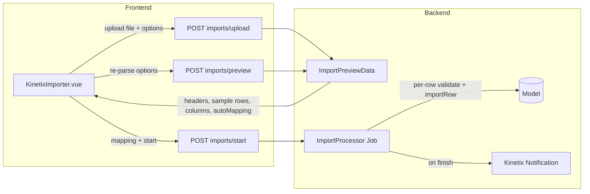

# Kinetix Import / Export

A queue-backed import pipeline with a **smart preview**: upload a CSV/Excel file, Kinetix parses it, auto-maps source headers to your target columns (collision-free), and lets the user fix the mapping before dispatching a customizable, queued import job. A completion notification is sent when it finishes.

> Excel (`.xls`/`.xlsx`) support uses `phpoffice/phpspreadsheet`. CSV/TSV are parsed natively.
> **Export** is documented in §6 (in progress).

---

## 1. Architecture



| Piece | Responsibility |
|---|---|
| `Importer` (abstract) | Declares target columns, the model, per-row import, queue/chunk config |
| `ImportColumn` | A target column: label, required, rules, alias guesses, value casting |
| `FileReader` | Parses CSV (native) and Excel (phpspreadsheet) honouring CSV options |
| `ImportController` | `upload` / `preview` / `start` endpoints |
| `ImportProcessor` | Queued job: maps rows, validates, imports, notifies, cleans up |
| `KinetixImporter.vue` | Smart-preview UI (upload, CSV options, mapping, preview, start) |

---

## 2. Defining an Importer

```php
namespace App\Kinetix\Importers;

use App\Models\Contact;
use Happones\Kinetix\Imports\Importer;
use Happones\Kinetix\Imports\ImportColumn;

class ContactImporter extends Importer
{
    protected static ?string $model = Contact::class;

    public static function getColumns(): array
    {
        return [
            ImportColumn::make('name')
                ->guess(['nombre', 'full name'])
                ->requiredMapping(),

            ImportColumn::make('email')
                ->guess(['e-mail', 'correo'])
                ->rules(['email'])
                ->castStateUsing(fn ($value) => strtolower(trim((string) $value))),

            ImportColumn::make('phone')
                ->guess(['celular', 'mobile', 'tel']),
        ];
    }

    // Optional: upsert instead of insert by resolving an existing record.
    public function resolveRecord(array $data): ?\Illuminate\Database\Eloquent\Model
    {
        return Contact::firstOrNew(['email' => $data['email'] ?? null]);
    }
}
```

### `ImportColumn` API

| Method | Description |
|---|---|
| `::make(string $name)` | Target attribute (matches the model column) |
| `->label(string)` | Display label (auto-generated from the name otherwise) |
| `->requiredMapping(bool = true)` | The user must map a source column before starting |
| `->rules(array\|string)` | Laravel validation rules applied per row |
| `->guess(array $aliases)` | Extra header names used for **automatic** mapping |
| `->castStateUsing(Closure)` | Transform the raw value before saving |
| `->fillRecordUsing(Closure)` | Custom write onto the record (`fn ($record, $value, $row)`) |

### `Importer` API

| Method | Description |
|---|---|
| `getColumns(): array` | The target columns (required) |
| `protected static $model` | The model written to (or override `resolveRecord()`) |
| `resolveRecord(array $data): ?Model` | Return an existing record for upsert; `null` inserts |
| `importRow(array $data): void` | Per-row handler (override for custom logic) |
| `chunkSize(): int` | Rows per DB transaction (default `1000`) |
| `queue(): ?string` | Queue the job runs on (default queue otherwise) |
| `token()` / `fromToken()` | Signed class token passed to/from the frontend |

### Smart auto-mapping

`Importer::guessMapping($headers)` matches each column against its name, label, and `guess()` aliases using a normalized comparison (case/spacing/punctuation insensitive — `NOMBRE` ≈ `name`). It is **collision-free**: each source header is claimed by at most one target column.

---

## 3. Endpoints

All under the configured Kinetix route prefix (default `_kinetix`), using the `web`+`auth` middleware:

| Route | Purpose |
|---|---|
| `POST {prefix}/imports/upload` | Store the file, return preview + auto-mapping |
| `POST {prefix}/imports/preview` | Re-parse the stored file with new CSV options |
| `POST {prefix}/imports/start` | Validate required mappings and dispatch the job |

The importer class travels as an encrypted token (`Importer::token()`), and the stored file is referenced by an encrypted `fileToken` constrained to the `kinetix-imports` directory.

---

## 4. Frontend

Pass the importer token to the page and render `KinetixImporter`:

```php
// Controller
return inertia('Contacts/Import', [
    'importer' => ContactImporter::token(),
]);
```

```vue
<script setup lang="ts">
import KinetixImporter from '@/components/kinetix/KinetixImporter.vue';
defineProps<{ importer: string }>();
</script>

<template>
    <KinetixImporter :importer="importer" />
</template>
```

The component provides: file upload (csv/tsv/xls/xlsx), a **CSV options** panel (delimiter, text enclosure, omit first N lines, has-header), the **mapping** grid (a `<select>` per target column, pre-selected from the auto-mapping, with already-used source columns disabled to prevent collisions), a live **preview** table that highlights mapped columns, and a **Start import** button that is disabled until all required columns are mapped.

---

## 5. The Queued Job

`ImportProcessor` reads the full file, maps each row by the chosen header indices, validates mapped columns against their `rules()`, calls `importRow()` per row inside chunked transactions, deletes the temp file, and finishes by sending a Kinetix notification:

- `Import complete` — `:imported imported, :failed skipped` (status `success`, or `warning` if any rows were skipped).
- Sent via `broadcast()` when Echo is configured, otherwise persisted with `sendToDatabase()`.

Customize the dispatch by overriding `queue()` and `chunkSize()`, or the whole per-row behaviour via `importRow()` / `resolveRecord()`.

---

## 6. Export

A queued `Exporter` streams records (CSV) or builds a workbook (Excel) to storage, then sends the user a **download notification** carrying a signed, time-unguessable download link.

```mermaid
graph LR
    A[exporter->export($user)] --> J[ExportProcessor Job]
    J -->|query->chunk| W[FileWriter csv/xlsx]
    W --> F[(storage/kinetix-exports)]
    J -->|on finish| N[Notification + Download action]
    N -->|signed token| D[GET exports/download]
    D --> F
```

### Defining an Exporter

```php
namespace App\Kinetix\Exporters;

use App\Models\Contact;
use Happones\Kinetix\Exports\Exporter;
use Happones\Kinetix\Exports\ExportColumn;

class ContactExporter extends Exporter
{
    protected static ?string $model = Contact::class;

    public function format(): string
    {
        return 'xlsx'; // or 'csv' (default)
    }

    public static function getColumns(): array
    {
        return [
            ExportColumn::make('name')->label('Full Name'),
            ExportColumn::make('email'),
            ExportColumn::make('created_at')
                ->label('Registered')
                ->formatStateUsing(fn ($value) => $value?->format('Y-m-d')),
        ];
    }

    // Optional: scope/filter what gets exported.
    public function query(): \Illuminate\Database\Eloquent\Builder
    {
        return Contact::query()->where('is_active', true);
    }
}
```

### Dispatching

```php
// Anywhere (controller, table toolbar action target, command):
(new ContactExporter())->export($request->user());
```

The export runs on the queue. When finished, the recipient gets a Kinetix notification (**Export ready**) with a **Download** action button. The link opens in a new tab and streams the file as an attachment.

### `Exporter` / `ExportColumn` API

| `Exporter` method | Description |
|---|---|
| `getColumns(): array` | The exported columns (required) |
| `protected static $model` / `query()` | Source records (override `query()` to filter) |
| `format(): string` | `'csv'` (default) or `'xlsx'` |
| `fileName(): string` | Download file name without extension |
| `chunkSize(): int` | Records per query chunk (default `1000`) |
| `queue(): ?string` | Queue the job runs on |
| `export(?Model $recipient): void` | Dispatch the queued export + notify the recipient |

| `ExportColumn` method | Description |
|---|---|
| `::make(string $name)` | Source attribute (dot-notation aware, enum friendly) |
| `->label(string)` | Column heading |
| `->formatStateUsing(Closure)` | Transform the value (`fn ($value, $record)`) |

### Download endpoint & security

`GET {prefix}/exports/download?token=…` (named `kinetix.exports.download`) streams the file. The token is an encrypted payload of the stored path + download name, constrained to the `kinetix-exports` directory; the route sits behind the configured `web`+`auth` middleware. It is registered **without** the team prefix so the URL can be generated from a queued job.
