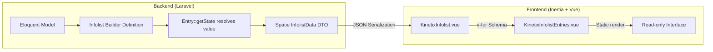
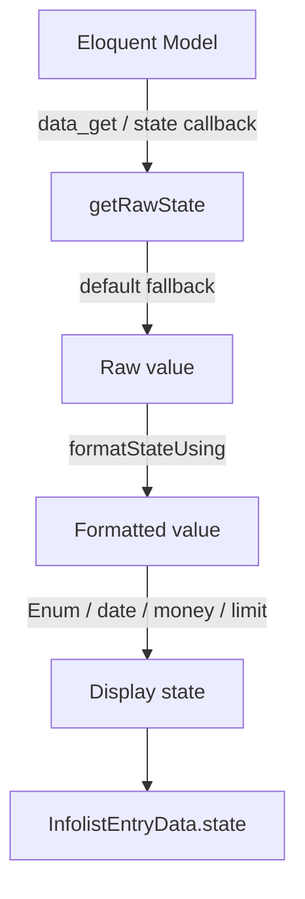

# Kinetix Infolists Complete Reference

Kinetix Infolists is a schema-driven, DTO-powered system for rendering **read-only** record details. It is the display-only twin of [Kinetix Forms](forms.md): you describe *what* to show in PHP — entries, layouts, formatting, visibility — and the configuration is serialized into a structured JSON DTO that is consumed natively by Vue 3 components.

Use an infolist on a resource's "View" page, inside a detail drawer, or anywhere you need to present a record without editing it.

---

## 1. Core Architecture & Concept

Unlike forms, infolists carry **no client-side state, validation, or hydration lifecycle**. Each entry resolves its display value on the server during serialization, so the frontend only renders pre-computed, already-formatted data. This keeps the Vue layer stateless, fast, and free of memory leaks (no watchers or two-way bindings are created).



### Key Principles

1. **Server-side state resolution** — Every entry's value (and its formatting) is computed in PHP via `getState()`. The frontend never recomputes it.
2. **Stateless rendering** — `KinetixInfolistEntries.vue` holds no reactive state beyond a transient "copied" flag, eliminating leak-prone watchers.
3. **Tailwind JIT compliance** — Column spans map to inline `grid-column` styles and colors map to a static class table, never to dynamically interpolated Tailwind class names.
4. **Shared contracts** — Entries honour the same `HasLabel`, `HasColor`, and `HasIcon` enum contracts used by Tables, so a single Enum drives badges, icons, and colors everywhere.

---

## 2. Building an Infolist

<Screenshot name="infolist" alt="Infolist — read-only record display" />

```php
use Happones\Kinetix\Infolists\Infolist;
use Happones\Kinetix\Infolists\Components\Section;
use Happones\Kinetix\Infolists\Components\Grid;
use Happones\Kinetix\Infolists\Components\TextEntry;
use Happones\Kinetix\Infolists\Components\IconEntry;

$infolist = Infolist::make($user)
    ->schema([
        Section::make('Account')
            ->description('Read-only account details.')
            ->icon('user')
            ->columns(12)
            ->schema([
                TextEntry::make('name')->columnSpan(6),
                TextEntry::make('email')
                    ->icon('mail')
                    ->copyable()
                    ->columnSpan(6),
                IconEntry::make('is_active')->boolean()->columnSpan(4),
                TextEntry::make('created_at')->dateTime()->columnSpan(8),
            ]),
    ]);

// Serialize for Inertia
return inertia('Users/Show', [
    'infolist' => $infolist->toArray(),
]);
```

### Builder methods

The `Infolist` instance exposes a small set of chainable setters:

| Method | Description |
|---|---|
| `->record(?Model)` | Bind the model whose state the entries resolve against |
| `->columns(int\|array)` | Top-level grid columns (default `1`) — see the responsive note below |
| `->operation(string)` | The operation context (default `'view'`), matched by entry `->visibleOn()` / `->hiddenOn()` |

::: tip Responsive by default
Infolist grids follow the same responsive system as [forms](/forms): an **int
means "this many columns from `lg` up, one below"**, so a `columns(12)` section
stacks on narrow layouts and spreads on wide ones. Every `columns()`
(`Infolist`, `Section`, `Fieldset`, `Grid`, `Tab`) and every `columnSpan()`
also accepts a breakpoint map (`['default' => 1, 'sm' => 2, 'xl' => 3]`), and
breakpoints measure the **infolist's own width** via container queries — a
record panel in a drawer collapses even on a wide viewport. Spans clamp to the
columns available at each size.
:::

### One-line rendering

```php
// Build + bind a record + serialize in a single call
$payload = UserInfolist::render($user);
```

### Reusable Infolist classes

Extend `Infolist` and declare the schema in `buildSchema()` so it can be reused across controllers:

```php
use Happones\Kinetix\Infolists\Infolist;

class UserInfolist extends Infolist
{
    protected function buildSchema(): array
    {
        return [
            Section::make('Account')->schema([
                TextEntry::make('name'),
                TextEntry::make('email')->copyable(),
            ]),
        ];
    }
}

// Usage
$payload = UserInfolist::render($user);
```

---

## 3. State Resolution Lifecycle



### `getRawState()`
Resolves the value via dot-notation `data_get($record, $name)` — supporting relationship attributes like `company.name` — or via a custom `->state(fn ($record) => ...)` callback. If the value is `null`/empty, the configured `->default()` is applied.

### `formatStateUsing()`
A closure to transform the raw value for display. Receives `(mixed $state, ?Model $record)`:

```php
TextEntry::make('full_name')
    ->state(fn ($record) => "{$record->first} {$record->last}");

TextEntry::make('status')
    ->formatStateUsing(fn ($state) => ucfirst($state));
```

### Enum resolution
Backed enums resolve to their `value`, pure enums to their `name`, and enums implementing `HasLabel` resolve to `getLabel()` — automatically.

---

## 4. Entry Types

All entries share these base methods (defined on `Entry`):

| Method | Description |
|---|---|
| `::make(string $name)` | Create an entry bound to a model attribute (dot-notation supported) |
| `->label(string\|Closure)` | Override the auto-generated label |
| `->placeholder(string\|Closure)` | Text shown when the state is empty (defaults to `—`) |
| `->default(mixed)` | Fallback value when the attribute is `null`/empty |
| `->state(Closure)` | Resolve the value with a custom callback |
| `->formatStateUsing(Closure)` | Transform the value before display |
| `->icon(string\|Closure)` | Leading icon (Lucide name) |
| `->color(string\|Closure)` | `primary` · `success` · `warning` · `danger` · `info` · `gray` |
| `->url(string\|Closure, bool $newTab = false)` | Render the value as a link |
| `->columnSpan(int\|string)` | Grid span (`'full'` or a column count) |
| `->visible()` / `->hidden()` | Boolean or `Closure` visibility |
| `->visibleOn()` / `->hiddenOn()` | Restrict by operation |
| `->authorize(string\|Closure\|bool, mixed $subject = null)` | Gate-based visibility (see [§6](#6-conditional-visibility)) |
| `->extraAttributes(array)` | Arbitrary attributes passed to the wrapper |

### TextEntry

The default entry for scalar values.

```php
TextEntry::make('title');
TextEntry::make('email')->copyable()->icon('mail');
TextEntry::make('status')->badge()->color(fn ($state) => $state === 'active' ? 'success' : 'gray');
TextEntry::make('published_at')->dateTime();          // localized (app locale)
TextEntry::make('created_at')->date('d/m/Y');
TextEntry::make('price')->money('USD');               // $1,234.50 USD
TextEntry::make('bio')->limit(120);                   // truncate long strings
TextEntry::make('role')->inlineLabel();               // label + value on one row
```

| Method | Description |
|---|---|
| `->badge(bool = true)` | Render the value as a colored badge |
| `->copyable(bool = true)` | Show a copy-to-clipboard button |
| `->date(?string $format = null)` | Format a date value — no argument = **localized** to the app locale via `config('kinetix.formats.date')` (isoFormat `ll`); a format string = plain PHP `format()` |
| `->dateTime(?string $format = null)` | Format a datetime value — same semantics, token `config('kinetix.formats.datetime')` (`lll`) |
| `->isoDate(?string $format = null)` / `->isoDateTime(?string $format = null)` | Explicit localized isoFormat tokens (Filament-compatible) |
| `->locale(string $locale)` | Override the formatting locale for this entry |
| `->money(string $currency = 'USD', int $divideBy = 1, ?string $locale = null)` | Format as **localized** currency via intl (`$1,234.50` en / `1.234,50 €` de); `$divideBy` converts minor units |
| `->limit(int)` | Truncate long strings with an ellipsis |
| `->inlineLabel(bool = true)` | Place the label and value side by side |

### IconEntry

Renders an icon driven by the state — ideal for booleans and statuses.

```php
IconEntry::make('is_verified')->boolean();   // check-circle/success or x-circle/danger

IconEntry::make('status')
    ->options([
        'heroicon-draft'     => 'draft',
        'heroicon-published' => 'published',
    ])
    ->colors([
        'warning' => 'draft',
        'success' => 'published',
    ]);
```

| Method | Description |
|---|---|
| `->boolean()` | Map truthy → `check-circle`/`success`, falsy → `x-circle`/`danger` |
| `->options(array $map)` | Map `icon => value\|Closure` |
| `->colors(array $map)` | Map `color => value\|Closure` |
| `->size(int\|string)` | Icon size in pixels (default `24`) |

### ImageEntry

```php
ImageEntry::make('avatar')
    ->circular()
    ->size(80)
    ->defaultImageUrl(fn ($record) => "https://ui-avatars.com/api/?name={$record->name}");
```

| Method | Description |
|---|---|
| `->circular()` / `->square()` | Image shape |
| `->size(int\|string)` | Width/height in pixels (default `96`) |
| `->defaultImageUrl(string\|Closure)` | Fallback when the attribute is empty |
| `->disk(string)` | Storage disk used to resolve stored paths to URLs |

Stored paths are resolved to public URLs automatically via `Storage::disk()->url()`. The disk defaults to the global `kinetix.filesystem.disk` config (falling back to `public`); `->disk('s3')` overrides it per entry. Absolute values — `http(s)://`, protocol-relative `//`, root-relative `/…`, and `data:` URIs — pass through untouched.

```php
ImageEntry::make('avatar')->disk('s3')->circular();
```

### ColorEntry

```php
ColorEntry::make('brand_color')->copyable();   // swatch + hex value
```

| Method | Description |
|---|---|
| `->copyable(bool = true)` | Show a copy-to-clipboard button for the hex value |

---

## 5. Layout Components

Layouts group entries and never resolve a value of their own. They honour the same visibility methods as entries.

### Section

A titled card container.

```php
Section::make('Billing')
    ->description('Invoicing & payment details.')
    ->icon('credit-card')
    ->columns(12)
    ->columnSpan('full')
    ->schema([
        TextEntry::make('plan')->columnSpan(6),
        TextEntry::make('renews_at')->date()->columnSpan(6),
    ]);
```

| Method | Description |
|---|---|
| `::make(string\|Closure $heading)` | Create a section with a heading |
| `->description(string\|Closure)` | Sub-heading text |
| `->icon(string\|Closure)` | Heading icon |
| `->columns(int)` | Inner grid columns (default `12`) |
| `->schema(array)` | Child components |
| `->actions(array)` | Header actions rendered in the section's top-right corner |

#### Section header actions

A section can carry its own `Action`s next to its heading. Each action is resolved against the record and auth-filtered (unauthorized actions are dropped), exactly like table actions:

```php
use Happones\Kinetix\Actions\EditAction;

Section::make('Account')
    ->actions([
        EditAction::make()->url(fn ($record) => route('users.edit', $record)),
    ])
    ->schema([
        TextEntry::make('name'),
        TextEntry::make('email')->copyable(),
    ]);
```

### Grid

A column wrapper without card chrome.

```php
Grid::make(12)->schema([
    TextEntry::make('width')->columnSpan(6),
    TextEntry::make('height')->columnSpan(6),
]);
```

### Fieldset

A labelled, bordered group (`<fieldset>` + legend) — lighter than a Section card.

```php
Fieldset::make('Billing')
    ->columns(12)
    ->schema([
        TextEntry::make('plan')->columnSpan(6),
        TextEntry::make('renews_at')->date()->columnSpan(6),
    ]);
```

| Method | Description |
|---|---|
| `::make(string\|Closure $label)` | Group label (rendered as the legend) |
| `->columns(int)` | Inner grid columns (default `12`) |
| `->schema(array)` | Child components |

### Tabs

Groups entries into switchable tabs. Each `Tab` has its own label, optional icon, columns, and schema. The active tab is tracked client-side per `Tabs` instance (no shared state, no leaks); hidden tabs are stripped during serialization.

```php
use Happones\Kinetix\Infolists\Components\Tabs;
use Happones\Kinetix\Infolists\Components\Tab;

Tabs::make()
    ->tabs([
        Tab::make('Profile')
            ->icon('user')
            ->columns(12)
            ->schema([
                TextEntry::make('name')->columnSpan(6),
                TextEntry::make('email')->columnSpan(6),
            ]),

        Tab::make('Activity')
            ->schema([
                TextEntry::make('last_login_at')->dateTime(),
            ]),
    ]);
```

| `Tabs` method | Description |
|---|---|
| `::make(?string $label = null)` | Optional accessible label for the tab group |
| `->tabs(array)` / `->schema(array)` | The `Tab` components |

| `Tab` method | Description |
|---|---|
| `::make(string\|Closure $label)` | Tab label |
| `->icon(string\|Closure)` | Tab icon (Lucide name) |
| `->columns(int)` | Inner grid columns for the tab body (default `12`) |
| `->schema(array)` | Child components shown when the tab is active |

---

## 6. Conditional Visibility

```php
TextEntry::make('internal_notes')
    ->visible(fn ($record) => auth()->user()->isAdmin());

TextEntry::make('deleted_at')
    ->visibleOn('view')
    ->hidden(fn ($record) => $record->deleted_at === null);
```

Hidden entries are dropped during serialization, so they never reach the client.

### Authorization (Gate/Policy)
Entries also support the same `->authorize()` shorthand as [Actions](actions.md#9-authorization--visibility) and [Form fields](forms.md#5-operations--visibility-constraints) — a Gate-based alternative to a `visible()` closure. An entry that fails its check is omitted from the serialized payload entirely.

```php
// Laravel policy ability — checked against the record via Gate::allows($ability, $record):
TextEntry::make('salary')->authorize('viewFinancials');

// Explicit subject, or any custom logic:
TextEntry::make('ssn')->authorize(fn ($record) => auth()->user()->isHr());
```

Without an explicit subject, a record-dependent ability defers to visible when no record is present yet, exactly like `Action::authorize()`.

---

## 7. Frontend Integration

After publishing the components (`php artisan vendor:publish --tag=kinetix-components`), render the serialized infolist:

```vue
<script setup lang="ts">
import KinetixInfolist from '@/components/kinetix/KinetixInfolist.vue';
import type { KinetixInfolistData } from '@/types/kinetix';

defineProps<{ infolist: KinetixInfolistData }>();
</script>

<template>
    <KinetixInfolist :infolist="infolist" />
</template>
```

| Component | Responsibility |
|---|---|
| `KinetixInfolist.vue` | Root wrapper; lays out top-level columns |
| `KinetixInfolistEntries.vue` | Recursive renderer for sections, grids, and every entry type |

---

## 8. Resource Integration

`Resource` exposes an `infolist()` hook alongside `form()` and `table()`:

```php
use Happones\Kinetix\Infolists\Infolist;
use Happones\Kinetix\Infolists\Components\TextEntry;

class UserResource extends Resource
{
    protected static ?string $model = User::class;

    public static function infolist(Infolist $infolist): Infolist
    {
        return $infolist->schema([
            TextEntry::make('name'),
            TextEntry::make('email')->copyable(),
            TextEntry::make('created_at')->dateTime(),
        ]);
    }
}
```

```php
// In the resource's "Show" controller action
$infolist = UserResource::infolist(Infolist::make($user));

return inertia('Users/Show', ['infolist' => $infolist->toArray()]);
```

---

## 8b. Recipe: a record "Show" page with tabs + actions

A polished detail page: the record's data organized in **tabs**, plus **Edit / Delete actions** in a page header. Entries themselves are read-only (no per-row actions), so page-level actions live in a **`KinetixPageHeader`** (or `Action::toArrayMany()`) next to the infolist — wire them to your routes. A **`Section`** can also carry its own header actions via **`Section::make(...)->actions([...])`**.

**1. The infolist with tabs:**

```php
use Happones\Kinetix\Infolists\Infolist;
use Happones\Kinetix\Infolists\Components\{Tabs, Tab, Section, TextEntry};

$infolist = Infolist::make($user)->schema([
    Tabs::make()->tabs([
        Tab::make('Profile')->icon('user')->columns(2)->schema([
            TextEntry::make('name'),
            TextEntry::make('email')->copyable(),
            TextEntry::make('status')->badge()
                ->color(fn ($s) => $s === 'active' ? 'success' : 'gray'),
            TextEntry::make('created_at')->dateTime(),
        ]),
        Tab::make('Billing')->icon('credit-card')->schema([
            Section::make('Plan')->schema([
                TextEntry::make('plan.name')->label('Current plan'),
                TextEntry::make('plan.price')->money('USD'),
            ]),
        ]),
    ]),
]);
```

**2. Page actions** (header) — built server-side and passed to the page:

```php
use Happones\Kinetix\Actions\{EditAction, DeleteAction};

return inertia('Users/Show', [
    'infolist' => $infolist->toArray(),
    'actions'  => \Happones\Kinetix\Actions\Action::toArrayMany([
        EditAction::make()->url(fn () => route('users.edit', $user)),
        DeleteAction::make()->inertiaVisit(route('users.destroy', $user), ['method' => 'delete']),
    ], $user),
]);
```

**3. The Vue page** pairs a header (actions) with the infolist:

```vue
<script setup lang="ts">
import KinetixPageHeader from '@/components/kinetix/KinetixPageHeader.vue';
import KinetixInfolist from '@/components/kinetix/KinetixInfolist.vue';

defineProps<{ infolist: any; actions: any[] }>();
</script>

<template>
  <KinetixPageHeader heading="User details" :actions="actions" />
  <KinetixInfolist :infolist="infolist" />
</template>
```

The `Tabs`/`Section` layouts render as a tabbed card with sections inside; `EditAction`/`DeleteAction` respect `authorize()` (drop when unauthorized) and route binding, exactly like in tables.

---

## 9. TypeScript Types

Serialized infolists map to generated TypeScript interfaces (`KinetixInfolistData`, `KinetixInfolistEntry`) in `resources/js/types/kinetix.ts`, kept in sync via Spatie's Laravel TypeScript Transformer.
