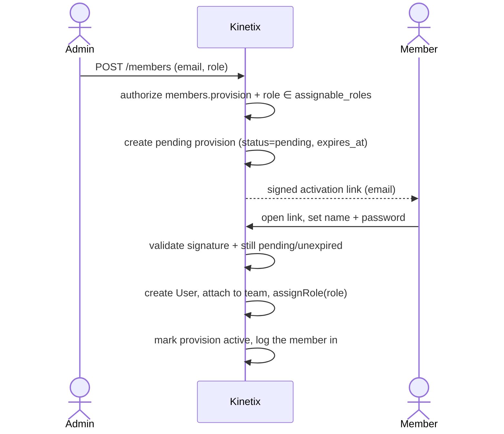
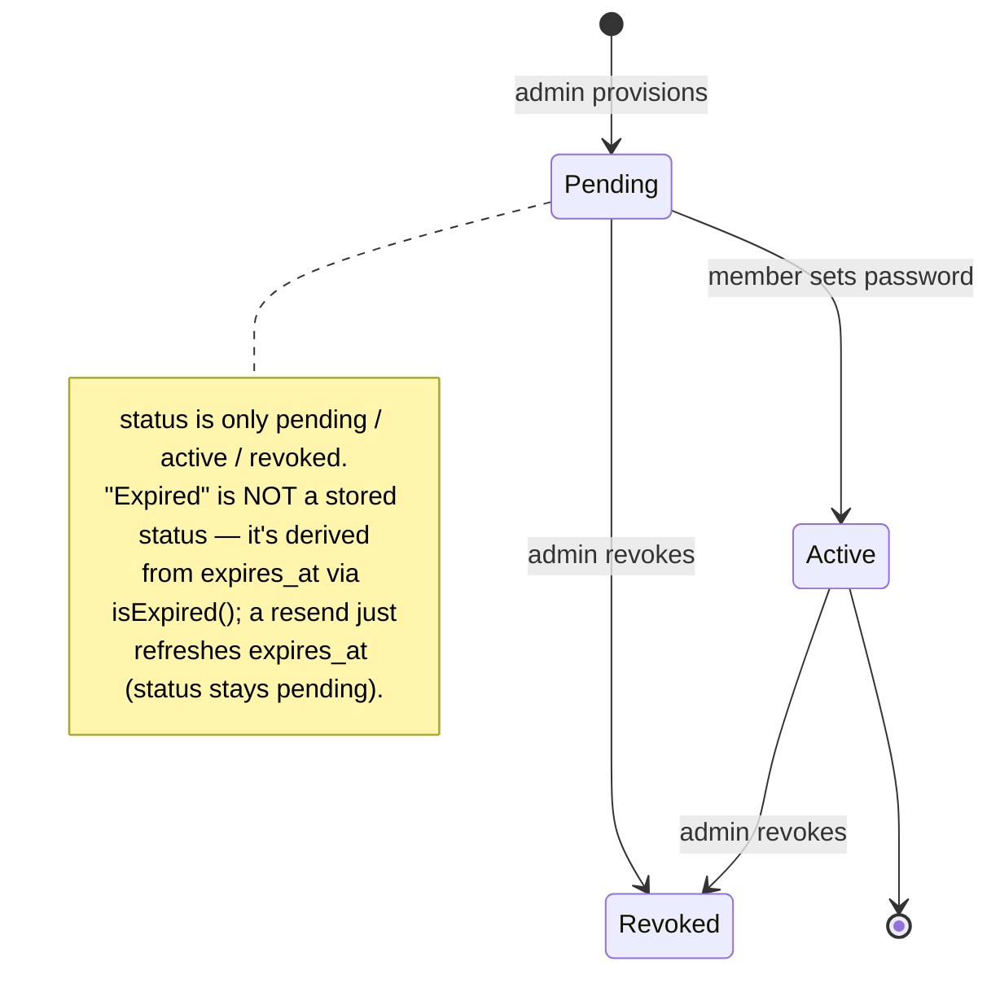
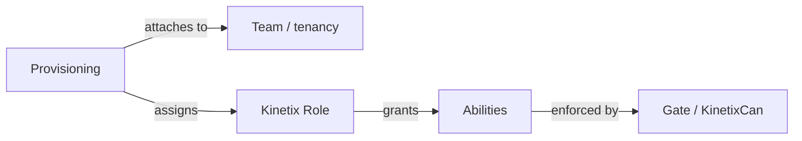

# Membership & Provisioning

Most starter kits assume a **consumer / self-serve** model: anyone registers,
gets their own *personal team*, becomes its *owner*, and grows it by emailing
peer **invitations** that the recipient self-accepts.

Many real projects need the opposite — an **admin-provisioned / directory**
model: an organization admin adds people, those people **do not** own anything
and **cannot** create their own team; they only **activate** their account by
setting a password. Registration is closed; the only way in is provisioning.

Kinetix Membership provides that second model as a drop-in alternative to the
starter kit's `InviteMemberModal` / `TeamInvitation` flow, and it composes
cleanly with the Kinetix [Roles & Permissions](/permissions) module.

::: danger Read this first — where the endpoints live
The module registers its **own** endpoints and `<KinetixMemberList>` calls them
itself. With teams on they live under:

```
{current_team}/{kinetix.route_prefix}/members/...   →  e.g. /acme/_kinetix/members
```

**Do not register your own `{current_team}/members` controller expecting the
component to hit it — it never will.** You register only the *Inertia page*
route. Run `php artisan kinetix:routes members` to see the resolved URIs,
methods and middleware.
:::

---

## 1. Two onboarding models

| Aspect | Starter-kit **Invitation** (self-serve) | Kinetix **Provisioning** (admin-controlled) |
|---|---|---|
| Who initiates | Anyone with `invitation:create` | An admin with `members.provision` |
| Account creation | Recipient **self-registers** | Admin pre-registers email + role |
| Activation | Recipient **accepts** an invite link | Member **sets a password** via signed link |
| Personal team | Auto-created on register (`is_personal=true`, `Owner`) | **None** — member joins the org team only |
| Role source | Fixed pivot enum (`Owner`/`Admin`/`Member`) | **Dynamic Kinetix role** (spatie), from a curated allow-list |
| Public registration | Open (`Features::registration()`) | **Closed** |
| Mental model | "Invite a collaborator" | "Add an employee to the directory" |

They are not competing implementations of the same idea — they are **different
onboarding philosophies**, which is why this is a *substitute* component, not a
new option on the same button.

---

## 2. Installation

Publish the provisions migration and run it:

```bash
php artisan vendor:publish --tag=kinetix-membership-migrations
php artisan migrate
```

Enable the module in `config/kinetix.php`:

```php
'membership' => [
    // Enable the provisioning module (opt-in)
    'enabled'           => env('KINETIX_MEMBERSHIP_ENABLED', false),

    // Scope provisioning to the active team: true/false wins, null (default)
    // inherits the global `kinetix.teams` switch. Keep it in agreement with
    // `permissions.teams` — provisions and the roles they assign should live
    // in the same tenancy model (kinetix:doctor warns when they disagree).
    'teams'             => env('KINETIX_MEMBERSHIP_TEAMS'),

    // The host's User model, created on activation
    'user_model'        => env('KINETIX_MEMBERSHIP_USER_MODEL', 'App\\Models\\User'),

    // Roles an admin is allowed to assign while provisioning. Anything outside
    // this list is rejected server-side — this is how you guarantee
    // "I add members but they never become admin". A static array, a
    // [Class, 'method'] pair, or an invokable class-string (see "Dynamic
    // allow-list" below for the recommended DB-backed resolver).
    'assignable_roles'  => ['editor', 'viewer'],

    // Hours an activation link stays valid
    'activation_expiry' => env('KINETIX_MEMBERSHIP_ACTIVATION_HOURS', 72),

    // Inertia page rendered for the set-password screen
    'activation_view'   => env('KINETIX_MEMBERSHIP_ACTIVATION_VIEW', 'Kinetix/MemberActivation'),

    // Where to send a member after a successful activation
    'redirect_after'    => env('KINETIX_MEMBERSHIP_REDIRECT', '/'),

    // Optional callables to (de)attach the activated user to the host's own team
    // pivot — Kinetix never touches it directly.
    // Signature: fn ($user, MemberProvision $provision) => void
    'attach_member'     => null,
    'detach_member'     => null,
],
```

> Authorization for the management endpoints flows through Laravel's `Gate`
> exactly like `roles.manage`. With the [Roles & Permissions](/permissions)
> module enabled, just grant the `members.*` abilities to a role. Without it,
> define those gates yourself.

::: danger `attach_member` is required in a teams app
Kinetix assigns the Kinetix **role** and never touches your `teams` pivot — the
host owns that row. So with team scoping on and `attach_member` left at `null`,
activation succeeds, the member gets their role… **and belongs to no team**, which
in a team-routed app means they can't reach a single page. Kinetix logs a warning
at boot when it detects that combination:

```
Kinetix: membership team scoping is on but `kinetix.membership.attach_member`
is null — activated members will NOT be linked to any team.
```

Point it at a **callable array** — see [step 3](#_6-adapting-the-starter-kit) and
the callback forms below:

```php
'attach_member' => [\App\Kinetix\SyncProvisionedMember::class, 'attach'],
```
:::

### Mail prerequisites

The activation link travels by email (`MemberActivationNotification`, an
on-demand mail notification), so provisioning silently depends on two things
the module can't set up for you:

1. **A working mailer** — the usual `MAIL_*` env block. In local dev, point it
   at Mailpit/log to see the links.
2. **A running queue worker.** The notification `implements ShouldQueue`: with
   `QUEUE_CONNECTION=database` (the starter-kit default) and **no worker
   running, no email is ever sent** — while the admin sees a perfectly
   successful "Invitation sent" toast. If you don't run workers, set
   `QUEUE_CONNECTION=sync`.

The email subject/body use the `kinetix.member_activation_*` translation keys
(all locales), so brand or reword it by overriding those keys in your published
lang files. For a fully custom email, extend
`Happones\Kinetix\Membership\MemberActivationNotification` and rebind it in the
container.

## 2.1 Callback options (`config:cache`-safe)

Four options here take a callback: `attach_member`, `detach_member`,
`assignable_roles`, and (in Permissions) `owner_bypass`. **Never write them as a
closure.** A closure in a config file makes the config uncacheable, so the app
cannot be deployed with `config:cache`:

```
Your configuration files could not be serialized because the value at
"kinetix.membership.attach_member" is non-serializable.
```

Kinetix accepts two serializable forms instead, both resolved through the
container (an instance method gets a container-resolved instance, so you can
inject dependencies):

```php
// 1. A callable array — [class-string, method]. The recommended form.
'attach_member'     => [\App\Kinetix\SyncProvisionedMember::class, 'attach'],
'detach_member'     => [\App\Kinetix\SyncProvisionedMember::class, 'detach'],

// 2. An invokable class-string, when the class does one thing.
'assignable_roles'  => \App\Kinetix\AssignableRoles::class,   // __invoke($teamId): array
```

```php
namespace App\Kinetix;

use App\Models\Team;
use Happones\Kinetix\Membership\MemberProvision;
use Illuminate\Database\Eloquent\Model;

class SyncProvisionedMember
{
    public function attach(Model $user, MemberProvision $provision): void
    {
        if ($provision->team_id !== null) {
            Team::find($provision->team_id)?->users()->attach($user->getKey());
        }
    }

    public function detach(?Model $user, MemberProvision $provision): void
    {
        if ($user !== null && $provision->team_id !== null) {
            Team::find($provision->team_id)?->users()->detach($user->getKey());
        }
    }
}
```

A closure still works in development (and is fine in a service provider that
assigns config at runtime), but the callable array is the only form that survives
`config:cache` — so it is what the guides use.

### Dynamic allow-list

A config array covers a fixed catalog. If your teams create their own roles in
the Roles UI, point `assignable_roles` at the built-in resolver — the invite
picker then offers exactly what the Roles screen shows, **the current team's
roles PLUS global (team-NULL) ones**, minus the protected roles:

```php
'assignable_roles' => \Happones\Kinetix\Permissions\AssignableRoles::class,
```

To withhold more names (e.g. keep `admin` promotion out of the invite flow),
wrap it in your own invokable:

```php
namespace App\Kinetix;

use Happones\Kinetix\Permissions\AssignableRoles as KinetixAssignableRoles;

class AssignableRoles
{
    public function __invoke(int|string|null $teamId): array
    {
        return KinetixAssignableRoles::names($teamId, except: ['admin']);
    }
}
```

::: warning Rolling your own query? Don't drop the global roles
A hand-written `where('team_id', $teamId)` silently excludes `team_id IS NULL`
— which is exactly where `KinetixRolesSeeder`'s `admin`/`editor`/`viewer`
presets live (seeded from the console = no team = global). The result is a
role that's fully manageable in the Roles UI and **invisible in the invite
picker**. The correct scope is the one `AssignableRoles::query()` gives you:

```php
->where(fn ($q) => $q->whereNull('team_id')->orWhere('team_id', $teamId))
```
:::

The callback is resolved on every request that lists or validates roles, so a
role created a second ago is immediately assignable — and it is still enforced
twice (provision + activation), the security boundary is unchanged. At
activation the callback receives the **provision's** team, since the signed
activation URL carries no `{current_team}` segment.

::: tip A list of role names is still just a list
An array is read as a callback **only** when it is a `[class-string, method]`
pair, so `['editor', 'viewer']` keeps meaning exactly what it looks like.
:::

---

## 3. Lifecycle: provision → activate

The module uses **pre-registration + activation**: the admin stores the email
and role as a *pending provision*; no `User` is created until the person
activates. This avoids orphaned, password-less accounts.



State of a single provision:



---

## 4. Data model

A lightweight pending-provision table (`kinetix_member_provisions`); the `User`
is only created on activation. It carries no foreign-key constraints because the
host's `teams`/`users` schema is unknown to the package.

| Column | Notes |
|---|---|
| `team_id` | Nullable — the module works without teams |
| `email` | Unique per team (`unique(team_id, email)`) |
| `name` | Collected at activation |
| `role` | A Kinetix role name |
| `invited_by` | The provisioning admin |
| `user_id` | Set on activation |
| `status` | `pending` · `active` · `revoked` |
| `expires_at` / `activated_at` | Activation window + completion |

> The activation **token** is not stored. The link is a Laravel
> `temporarySignedRoute`, so validity is the signature plus the provision's
> `pending`, unexpired status — single-use without a bespoke token column.

---

## 5. Backend surface

The module registers a `members` feature with the permission registry, so its
abilities show up in the [permission matrix](/permissions#_6-role-management-ui)
and `kinetix:permissions:sync`:

* `members.viewAny` — View members
* `members.provision` — Add / invite members
* `members.update` — Change a member's role
* `members.revoke` — Remove members

Endpoints (mounted under the Kinetix route prefix — the same pattern as the
permission routes). `{prefix}` is `{current_team}/_kinetix` with teams on,
`_kinetix` without; `php artisan kinetix:routes members` prints the resolved URIs:

| Method | Endpoint | Ability | Description |
|---|---|---|---|
| `GET` | `{prefix}/members` | `members.viewAny` | List provisions + the assignable-role allow-list |
| `POST` | `{prefix}/members` | `members.provision` | Provision an email + role |
| `POST` | `{prefix}/members/{provision}/resend` | `members.provision` | Re-send the activation link |
| `PUT` | `{prefix}/members/{provision}` | `members.update` | Change a member's role |
| `DELETE` | `{prefix}/members/{provision}` | `members.revoke` | Revoke a member |
| `GET` | `/members/activate/{provision}` | — (signed) | Public set-password page |
| `POST` | `/members/activate/{provision}` | — (signed) | Complete activation |

The **allow-list check is the security boundary** for your requirement: even a
user who can `members.provision` cannot escalate someone to `admin` if `admin`
is not in `membership.assignable_roles`. It is re-checked at activation time too,
in case config changed between provisioning and the click.

---

## 6. Adapting the starter kit

To switch a starter-kit app from the invitation model to this one, four changes
are needed:

1. **Skip personal-team creation.** In `app/Actions/Fortify/CreateNewUser.php`
   the starter kit calls `CreateTeam::handle(..., isPersonal: true)`. Gate that
   behind a config flag (or remove it) so provisioned members don't get a
   personal team.
2. **Close public registration.** Drop `Features::registration()` from
   `config/fortify.php`; the only entry point becomes the activation link.
3. **Attach members to your team** — *mandatory with teams on*, or activated
   members belong to nothing. Point `membership.attach_member` at a callback that
   writes your team pivot; Kinetix assigns the Kinetix role, the host owns the
   membership row. Use the callable-array form so `config:cache` keeps working
   (see [§2.1](#_2-1-callback-options-config-cache-safe) for the class):
   ```php
   'attach_member' => [\App\Kinetix\SyncProvisionedMember::class, 'attach'],
   ```
4. **Swap the UI.** Replace `InviteMemberModal` with `<KinetixMemberList>`.

---

## 7. Frontend (Vue / Inertia)

All components publish like the rest of Kinetix and read the same reactive
`kinetix_permissions` prop, so you gate them with the same `{feature}.{ability}`
keys. The role dropdown only ever offers roles in the server-enforced allow-list
(with the [`AssignableRoles` resolver](#dynamic-allow-list): the team's roles
plus global ones, minus protected roles).

### 7.1 Members directory

`<KinetixMemberList>` is the drop-in screen: it embeds the provisioning form and
lists members (pending / active / revoked) with search, per-row pending states,
a confirm dialog on Remove, and role change / resend / revoke. Revoked rows show
the role as read-only history — re-provision to bring someone back (the server
rejects role changes and resends on revoked provisions with a 422).

Register only the Inertia **page** route (the data flows through the built-in
endpoints, exactly like the roles pages):

```php
// routes/web.php — plain:
Route::middleware(['auth'])->get('members', fn () => inertia('Members/Index'))
    ->name('members.index');

// or team-routed:
Route::middleware(['auth'])->get('{current_team}/members', fn () => inertia('Members/Index'))
    ->name('members.index');
```

```vue
<!-- resources/js/pages/Members/Index.vue -->
<script setup lang="ts">
import { useKinetixCan } from "@/composables/useKinetixCan";
import KinetixMemberList from "@/components/kinetix/KinetixMemberList.vue";

const { can } = useKinetixCan();
</script>

<template>
  <KinetixMemberList v-if="can('members.provision')" />
</template>
```

<Screenshot name="member-list" alt="Member list with provisioning form" />

Need a custom layout? Compose the presentational
`<KinetixMemberProvisioner :assignable-roles="..." @submit="...">` form with the
`useKinetixMembers()` composable (`load`, `provision`, `resend`, `updateRole`,
`revoke`, plus the reactive `provisions` / `assignableRoles`).

### 7.2 Activation page

`<KinetixMemberActivation>` is the public set-password screen. Create the page
file at **`resources/js/pages/Kinetix/MemberActivation.vue`** (that's what the
default `membership.activation_view` resolves to — or change the config to any
page you already have), forwarding the `email` and `action` props the
controller passes:

```vue
<script setup lang="ts">
import KinetixMemberActivation from "@/components/kinetix/KinetixMemberActivation.vue";

defineProps<{ email: string; action: string }>();
</script>

<template>
  <KinetixMemberActivation :email="email" :action="action" />
</template>
```

<Screenshot name="member-activation" alt="Member activation — set password" />

Email is fixed (it came from the provision); the member only sets a name and
password, and the form posts back to the signed `action` URL.

---

## 8. How it composes with Roles & Permissions

The two modules are **independent but complementary**:

- **Teams answer _where_** — the tenancy boundary a member belongs to.
- **Roles/Permissions answer _what_** — the abilities a member has.
- **Provisioning sits at the intersection** — a single action that *adds a user
  to a team* **and** *assigns a Kinetix role*, with the assignable set policed
  by config.



You can adopt either module alone:

- **Permissions without provisioning** — keep the starter kit's invitations, but
  resolve abilities through Kinetix roles instead of the pivot enum.
- **Provisioning without permissions** — provision members and gate the
  endpoints with your own `members.*` gates; you lose the dynamic role matrix but
  the onboarding flow stands on its own.

### Assigning a role to a user who already exists

Kinetix ships no UI for "give this existing user a role" outside the members
list — if you keep the starter kit's invitation flow, assign the role yourself
where the user joins the team. **With teams active, pin spatie's team id
first**: `assignRole()` stamps whatever the registrar currently holds, and in a
listener/job that's undefined:

```php
use Spatie\Permission\PermissionRegistrar;

$registrar = app(PermissionRegistrar::class);
$previous  = $registrar->getPermissionsTeamId();
$registrar->setPermissionsTeamId($team->getKey());

try {
    $user->assignRole('editor');   // resolves team + global roles by name
} finally {
    $registrar->setPermissionsTeamId($previous);
}
```

(That try/finally is exactly what the built-in provisioning endpoints do
internally on activation, role change and revoke.)

Used together, you get the full B2B story: a closed directory where admins add
people and hand them exactly the capabilities you allow — never owner, never
admin, never a stray personal team.

---

## 9. Security considerations

- **Signed, expiring, single-use** activation links (Laravel signed URLs); never
  a plain incrementing id — validity is the signature plus the `pending` status.
- **Don't leak existence** — provisioning re-uses `updateOrCreate`, so a repeat
  on a known email looks the same as a fresh one.
- **Rate-limit** the activation and resend endpoints in your app — the route
  names are `kinetix.membership.activate.show` / `kinetix.membership.activate`
  (public, signed) and `kinetix.membership.resend`; e.g. a
  `RateLimiter::for()` keyed by IP applied via `->middleware('throttle:...')`
  in a route group that wraps them, or globally with `kinetix.middleware`.
- **State machine is enforced** — a revoked provision rejects role changes and
  resends (422; re-provision deliberately instead), and resend on an active
  member is a 422 too (an activation link for an existing user would try to
  create a duplicate).
- **The allow-list is enforced twice** — at provision time and again at
  activation, so a later config change can't be exploited by an old link.
- **Audit** who provisioned/revoked whom (`invited_by`, timestamps) — this is a
  privileged, organization-shaping action.
