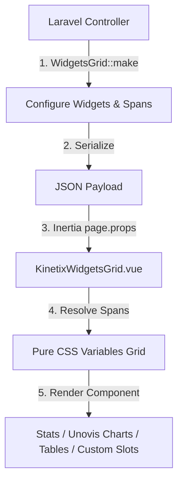

# Kinetix Widgets Reference

Kinetix Widgets is a modular, class-based widget system for building rich, responsive dashboard grids in Laravel applications. Using a fluent PHP builder API, you construct grid configurations and datasets, serialize them into a lightweight JSON payload, and render them with Vue 3, Inertia.js 3, and TypeScript.

---

## 1. Core Architecture & Concept

Kinetix Widgets separates layout rules and metric computations from the visual display. A dashboard is defined as a `WidgetsGrid` container containing one or more `Widget` implementations.



### Key Principles
1. **Separation of Concerns**: Backend controls layout ratios, query scoping, and trend data; frontend handles theme styling, responsive adjustments, and chart tooltips.
2. **Pure CSS Grid Variables**: Layouts map column spans to CSS Custom Properties rather than Tailwind utility strings, making layout spacing immune to Tailwind class compilation purges.
3. **Native Unovis Charting**: Interactive charts are backed by `@unovis/vue` for modern, responsive visualization.
4. **Extensible Slots**: Custom widgets allow developers to drop down to custom Vue templates for interactive operations.

---

## 2. Quick Start Example

<Screenshot name="stats-widget" alt="Stats overview widget" />

<Screenshot name="chart-widget" alt="Chart widget (Unovis)" />

<Screenshot name="table-widget" alt="Table widget" />

<Screenshot name="custom-widget" alt="Custom slot widget" />

### 1. Backend Controller Blueprint
Define your grid columns, stats overview trend lines, and charts, then pass the payload to Inertia:

```php
use Happones\Kinetix\Widgets\WidgetsGrid;
use Happones\Kinetix\Widgets\StatsOverviewWidget;
use Happones\Kinetix\Widgets\Stats\Stat;
use Happones\Kinetix\Widgets\ChartWidget;
use Happones\Kinetix\Widgets\TableWidget;
use Happones\Kinetix\Widgets\CustomWidget;

public function __invoke()
{
    $grid = WidgetsGrid::make()
        ->columns([
            'default' => 12,
            'md' => 6,
            'lg' => 4,
        ])
        ->widgets([
            // Stats Overview Card List
            StatsOverviewWidget::make()
                ->columnSpan('full')
                ->sort(1)
                ->stats([
                    Stat::make('Active Subscriptions', 1420)
                        ->description('8.2% increase')
                        ->descriptionIcon('trending-up')
                        ->descriptionColor('success')
                        ->chart([12, 14, 13, 15, 18, 22]),
                ]),

            // Unovis Line Chart
            ChartWidget::make()
                ->id('revenue_chart')
                ->title('Monthly Revenue')
                ->chartType('line')
                ->columnSpan([
                    'default' => 12,
                    'lg' => 8,
                ])
                ->labels(['Jan', 'Feb', 'Mar', 'Apr', 'May', 'Jun'])
                ->datasets([
                    [
                        'label' => 'Gross Sales',
                        'data' => [4200, 5100, 4800, 6200, 7100, 8500],
                        'borderColor' => '#6366f1',
                        'backgroundColor' => 'rgba(99, 102, 241, 0.05)',
                        'fill' => true,
                    ]
                ]),

            // Custom Layout Slot Widget
            CustomWidget::make()
                ->id('active_users_map')
                ->title('Live Active Session Map')
                ->columnSpan([
                    'default' => 12,
                    'lg' => 4,
                ])
                ->properties([
                    'refreshRate' => 3000,
                ]),
        ]);

    return inertia('Admin/Dashboard', [
        'dashboardGrid' => $grid->toArray(),
    ]);
}
```

### 2. Frontend Page Mounting
Mount the grid in Vue and write custom slots matching any custom widget IDs:

```vue
<script setup lang="ts">
import KinetixWidgetsGrid from '@/components/kinetix/KinetixWidgetsGrid.vue';
import type { KinetixWidgetsGridData } from '@/types';

defineProps<{
    dashboardGrid: KinetixWidgetsGridData;
}>();
</script>

<template>
    <div class="py-8 max-w-7xl mx-auto px-4 sm:px-6">
        <KinetixWidgetsGrid :grid="dashboardGrid">
            <!-- Custom Slot matches CustomWidget ID 'active_users_map' -->
            <template #active_users_map="{ widget }">
                <div class="p-6 h-[300px] flex flex-col justify-between bg-neutral-900 text-white rounded-xl">
                    <div>
                        <h4 class="font-semibold text-sm">Session Interval</h4>
                        <p class="text-xs text-neutral-400 mt-1">
                            Polling every {{ widget.data.properties.refreshRate }}ms
                        </p>
                    </div>
                    <div class="text-center py-6 text-sm text-neutral-500">
                        [Interactive Map Visualizer Component]
                    </div>
                </div>
            </template>
        </KinetixWidgetsGrid>
    </div>
</template>
```

---

## 3. Unovis XY-Axis Chart Indexing Strategy

When displaying continuous scale XY charts (such as **Line** and **Bar** charts) in Unovis, passing raw string labels (e.g. `'Jan'`, `'Feb'`) directly as coordinate keys can cause continuous coordinate scaling errors and render `NaN` values.

```
[Unovis Error]: Scale failure, continuous coordinate mapping expected a numeric value but received 'Jan'. Coordinates rendered as NaN.
```

### The Kinetix Indexing Solution
To prevent scale failure, Kinetix serializes string labels into a numeric index reference map on serialization. The chart data points are plotted using integer indices (`0, 1, 2, ...`) along the X-axis coordinate path:

```json
{
  "labels": ["Jan", "Feb", "Mar"],
  "datasets": [
    {
      "label": "Gross Sales",
      "data": [
        {"x": 0, "y": 4200},
        {"x": 1, "y": 5100},
        {"x": 2, "y": 4800}
      ]
    }
  ]
}
```

### Frontend Tick Formatting
Inside the `KinetixChartWidget.vue` component, the Unovis `<VisAxis>` component utilizes two parameters to reconstruct the strings:
1. **`tickValues`**: Restricts gridline markers exactly to integers within the index range (`[0, 1, 2, ...]`).
2. **`tickFormat`**: Formats indices back to their human-friendly labels:
   ```ts
   const xTickFormat = (index: number): string => {
       return props.widget.data.labels[index] || '';
   };
   ```

This indexing approach guarantees smooth coordinate transitions, correct spacing, and stable tick distribution across light and dark theme canvas layouts.

---

## 4. SVG Sparkline Visualization

The `StatsOverviewWidget` renders miniature trend sparkline graphics without the performance overhead of full chart rendering instances.

### How Sparklines Render
Frontend components project numeric charts into a single `<svg>` element containing a mapped polyline path:

```vue
<!-- Simplified Sparkline Structure (index = the v-for index of the stat) -->
<svg class="h-10 w-full overflow-visible">
    <defs>
        <linearGradient :id="`gradient-${index}`" x1="0" y1="0" x2="0" y2="1">
            <stop offset="0%" :stop-color="trendColor" stop-opacity="0.2" />
            <stop offset="100%" :stop-color="trendColor" stop-opacity="0.0" />
        </linearGradient>
    </defs>
    
    <!-- Mapped polyline coordinates -->
    <path 
        :d="svgPathPoints" 
        fill="none" 
        :stroke="trendColor" 
        stroke-width="1.5" 
    />
    
    <!-- Gradient area fill -->
    <path 
        :d="svgFillPoints" 
        :fill="`url(#gradient-${index})`" 
    />
</svg>
```

### Sparkline Coordinate Calculations
Coordinate paths are scaled to fill the visual box boundaries using the index positions and boundary limits:
- **X Coordinate**: `(index / (totalPoints - 1)) * containerWidth`
- **Y Coordinate**: `containerHeight - ((value - minValue) / (maxValue - minValue)) * containerHeight`

---

## 5. Responsive Layout Mechanics (CSS Variables)

Tailwind grids depend on static class compilation (e.g. `col-span-4`, `md:col-span-6`). When class definitions are constructed dynamically on the backend (e.g. `->columnSpan($span)`), JIT compilers cannot parse them, causing layouts to fail.

To solve this, `KinetixWidgetsGrid.vue` converts column settings into inline CSS variables:

```vue
<div 
    class="kinetix-grid" 
    :style="{
        '--columns-default': grid.columns.default || 12,
        '--columns-md': grid.columns.md,
        '--columns-lg': grid.columns.lg,
    }"
>
    <!-- Child Widgets -->
</div>
```

### Scope Grid Media Queries
Inside the `<style scoped>` tag of the grid, standard CSS media queries intercept layout calculations to adjust grid alignments:

```css
.kinetix-grid {
    display: grid;
    grid-template-columns: repeat(var(--columns-default), minmax(0, 1fr));
    gap: 1.5rem;
}

@media (min-width: 768px) {
    .kinetix-grid {
        grid-template-columns: repeat(var(--columns-md, var(--columns-default)), minmax(0, 1fr));
    }
}

@media (min-width: 1024px) {
    .kinetix-grid {
        grid-template-columns: repeat(var(--columns-lg, var(--columns-md)), minmax(0, 1fr));
    }
}
```

This layout system ensures that cards adapt smoothly to any resolution.

---

## 6. Widget Types Reference

### Shared Widget API

Every widget extends the abstract `Widget` base class and inherits the following fluent methods (each returns `static` for chaining):

| Method | Signature | Purpose |
|---|---|---|
| `id` | `id(string $id)` | Override the auto-generated widget id (matches the Vue slot name for custom widgets). |
| `title` | `title(string $title)` | Display title. |
| `description` | `description(string $description)` | Supporting description text. |
| `columnSpan` | `columnSpan(int\|string\|array $columnSpan)` | Grid span — an integer, a string (e.g. `'full'`), or a responsive breakpoint map. Defaults to `12`. |
| `sort` | `sort(int $sort)` | Order within the grid. Defaults to `0`. |
| `headerAction` | `headerAction(string $label, string $url, ?string $icon = null)` | Add a link/button to the widget header (e.g. "Export", "View all"). Chainable for multiple. Rendered in Chart/Table/List widget headers. |

All widgets are created via `Widget::make()` and serialize to a `{ id, type, title, description, columnSpan, sort, headerActions, data }` payload.

For arbitrary custom content (a hero/CTA card, a segmented control), use a
`CustomWidget` and its per-id named slot in `<KinetixWidgetsGrid>`.

### 1. `StatsOverviewWidget`
Groups multiple statistical KPI cards.
- **Methods**:
  - `stats(array $stats)`: Mapped array of `Stat` builders.
- **`Stat` Properties**:
  - `Stat::make(string $label, mixed $value)`: Create a stat metric.
  - `icon(string $icon)`: a leading Lucide icon shown in a colored badge on the card (e.g. `dollar-sign`, `shopping-cart`, `users`, `package`).
  - `iconColor(string $color)`: the icon badge color — `success` / `danger` / `warning` / `info` / `gray`. Defaults to `info`.
  - `description(string $desc)`: supporting/trend text (e.g. `+12.5% vs yesterday`).
  - `descriptionIcon(string $icon)`: trend icon, e.g. `arrow-up` / `arrow-down`.
  - `descriptionColor(string $color)`: trend color (`success` / `danger` / `warning` / `info` / `gray`). Defaults to `gray`.
  - `badge(string $text, string $color = 'gray')`: a small trend chip in the card header (e.g. `('+6.1%', 'success')`).
  - `url(string $label, string $href)`: a footer link (e.g. `('View more', '/revenue')`).
  - `chart(array $trendPoints)`: numeric array to draw an SVG sparkline (shown when no `icon` is set).

```php
Stat::make('Sales today', '$502.30')
    ->icon('dollar-sign')->iconColor('info')
    ->description('+12.5% vs yesterday')->descriptionIcon('arrow-up')->descriptionColor('success');
```

### 2. `ChartWidget`
Interactive metrics charting backed by Unovis.
- **Methods**:
  - `chartType(string $type)`: `line`, `area` (stacked filled), `bar`, `horizontalBar`, `pie`, `doughnut`.
  - `labels(array $labels)`: Category names list.
  - `datasets(array $datasets)`: Dataset configuration arrays.
  - `stacked(bool $on = true)`: stack multiple series (area is always stacked; `bar` becomes a stacked bar).
  - `legend(bool $on = true)`: show a labelled color-swatch legend below the chart.
  - `centerLabel(string $value, ?string $caption = null)`: a big value + caption in the middle of a `pie`/`doughnut` (e.g. `('10.2K', 'Visitors')`).
  - `options(array $options)`: Custom chart properties payload.

```php
ChartWidget::make()->title('Total visitors')->chartType('area')->legend()
    ->labels(['Mon', 'Tue', 'Wed'])
    ->datasets([
        ['label' => 'Desktop', 'data' => [12, 19, 15]],
        ['label' => 'Mobile', 'data' => [8, 11, 9]],
    ]);

ChartWidget::make()->title('Store visits')->chartType('doughnut')
    ->centerLabel('10.2K', 'Visitors')->legend()
    ->labels(['Direct', 'Social', 'Email'])->datasets([['data' => [4200, 2600, 1800]]]);
```

### 3. `TableWidget`
Renders quick-reference summary tables.
- **Methods**:
  - `headers(array $headers)`: Header titles.
  - `rows(array $rows)`: List of table rows (supports flat arrays or key-value arrays).

### 4. `ListWidget`
A list/feed panel — recent activity, stock alerts, latest orders, etc. Each row
has a leading icon badge, a title + subtitle, an optional trailing value/badge,
and an optional progress bar; an optional footer renders a link button.
- **Methods**:
  - `items(array $items)`: array of `ListItem` builders.
  - `icon(string $icon)`: header icon next to the title.
  - `action(string $label, string $url)`: footer link button.
  - `emptyState(string $text)`: message shown when there are no items.
- **`ListItem` Properties**: `ListItem::make($title)->subtitle()->icon($name, $color)->value($text)->badge($text, $color)->progress(int 0–100)->url($href)`.

```php
ListWidget::make()
    ->title('Stock alerts')->icon('alert-triangle')
    ->items([
        ListItem::make('Jugo Del Valle 1L')->subtitle('Out of stock')
            ->icon('alert-triangle', 'danger')->badge('0', 'danger'),
        ListItem::make('Sabritas 45g')->progress(20)->value('3'),
    ])
    ->action('View inventory', '/inventory');
```

### 5. `RatingWidget`
A ratings summary — an average score + stars and a per-level breakdown (like a
"Customer Reviews" panel).
- **Methods**:
  - `average(float)`: the average score (drives the stars, supports half-stars).
  - `total(int)`: total number of reviews (shown as "Based on N reviews").
  - `max(int = 5)`: the star scale.
  - `breakdown(array $levelToCount)`: `[5 => 4000, 4 => 2100, …]` — emitted high→low with computed bar percentages.

```php
RatingWidget::make()->title('Customer reviews')
    ->average(4.5)->total(5500)
    ->breakdown([5 => 4000, 4 => 2100, 3 => 800, 2 => 631, 1 => 344]);
```

### 6. `CustomWidget`
A wrapper widget designed to expose custom slots.
- **Methods**:
  - `properties(array $payload)`: Custom settings and variables payload serialized to the Vue template.

